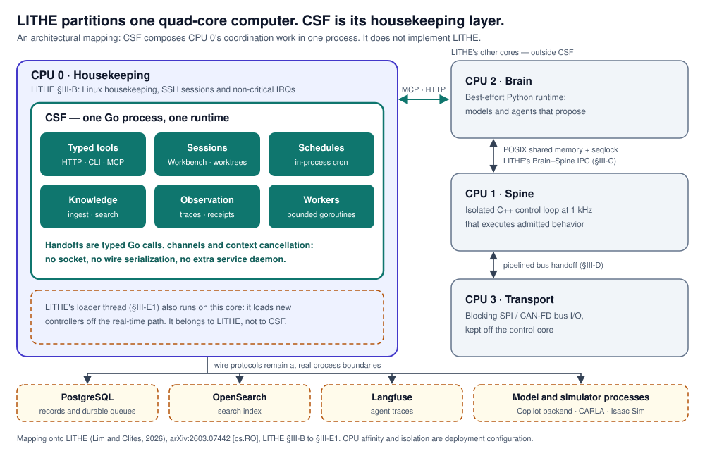
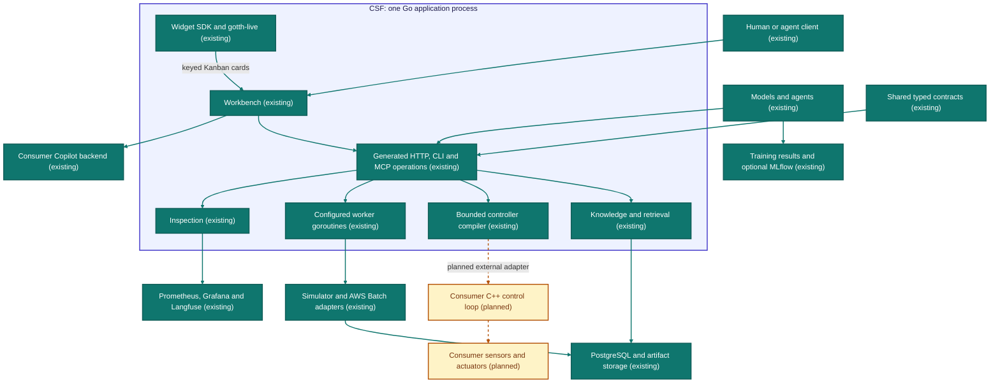

<div align="center">
  
  <p><b>One Go runtime for agent work, typed tools, shared knowledge and observable experiments.</b></p>
  <p>
    <a href="LICENSE"></a>
    <a href="#6-consume-it"></a>
    <a href="#8-build-it"></a>
    <a href="https://arxiv.org/abs/2603.07442"></a>
    <a href="#1-introduction"></a>
  </p>
  <p><i>Developer preview. The first release makes no stability or compatibility promise.</i></p>
  <p>
    <a href="#2-why-csf-no-ipc-inside-cpu-0"><b>Why CSF</b></a> ·
    <a href="#3-proofs-not-just-hardware-csf-and-lithes-safety-problem"><b>Proofs</b></a> ·
    <a href="#4-architecture"><b>Architecture</b></a> ·
    <a href="#5-quick-start"><b>Quick start</b></a> ·
    <a href="csf/README.md"><b>CSF guide</b></a> ·
    <a href="AGENTS.md"><b>Agent instructions</b></a> ·
    <a href="#10-citation"><b>Citation</b></a>
  </p>
</div>

<hr>

## 1. Introduction

**CSF — The Cerebrospinal Fluid** is a Go library and runtime for the
coordination around an agent system: typed tools, sessions and worktrees,
schedules, knowledge ingestion and search, traces and retained evidence. Its
services are libraries mounted into one Go process through functional options,
and its operations are generated once and served as HTTP, CLI and MCP.

The name comes from the architecture that shaped it. In LITHE
([Lim and Clites, 2026](#ref-lithe)), a best-effort **Brain** proposes and a real-time **Spine** executes, on one
partitioned computer. CSF is the fluid around them: the housekeeping layer that
carries tools, records and experiments between decisions.

This repository is one Go module with a root Bazel build and the separate
[`csfc` compiler build](csf/compiler/README.md): the public half of a private
infrastructure monorepo, published whole. It is not a framework and not a grab
bag. It is a working agent-operated deployment system and the pieces it is built
from, released together so that the pieces are usable on their own and the
system is reproducible as a whole.

| | |
|---|---|
| [**CSF — The Cerebrospinal Fluid**](csf) | Shared Go coordination for agents, typed tools, knowledge and simulation evidence. Start with the [consumer example](examples/csf-consumer). |
| [**CandaceOS**](services/candaceos) | An agent-operated app lab: a harness proposes, Core approves and fences, a node executor reconciles Compose applications, and an operator UI watches. Its deployment kit is [`candaceos/`](candaceos). |
| [**Warden**](services/warden) | A fleet watchdog: Raft-style leader election over a static peer set, liveness, incidents, and an authoritative view every mutation is fenced against. |
| [**gotth-live**](pkg/gotth) | Server-driven live user interfaces from Go. State and rendering stay in your process; one WebSocket per tab carries events up and re-rendered fragments down. No npm, no CDN. |
| [**xetcas**](xetcas) | A self-hosted Xet content-addressable storage server with a Git LFS front door. Re-pushing a 48 MiB model after editing 2% of it costs about 1 MiB. |
| [**pkg/**](pkg) | The primitives the rest is built on: `pgmem` (a process-local PostgreSQL emulator for tests), `liquidproto` (protobuf refinement types), `cron`, `config`, `redact`, `telemetry`, and more. |

**Status: CSF's first release, 0.1.0, is a developer preview** and a breaking
integration baseline. It makes no stability or compatibility promise: pin a
reviewed snapshot and use the examples shipped with it. The Go import is
`github.com/candacelabs/csf/csf`; this release makes no backward-compatibility
claim for earlier experimental CSF interfaces.

First-party source is Apache-2.0. Dependencies, vendor simulator images and
externally hosted paper figures retain their own licenses.

## 2. Why CSF: no IPC inside CPU 0

LITHE runs a whole robot control hierarchy on one quad-core single-board
computer by partitioning its cores (LITHE
[§III-B](https://arxiv.org/html/2603.07442v1#S3.SS2)):

| LITHE core | Role in LITHE |
|---|---|
| **CPU 0 (Housekeeping)** | Linux housekeeping, SSH sessions and non-critical interrupts. It absorbs system jitter, and LITHE's loader thread prepares new controllers here (LITHE [§III-E1](https://arxiv.org/html/2603.07442v1#S3.SS5.SSS1)). |
| CPU 1 (Spine) | The C++ control loop, alone on an isolated core. |
| CPU 2 (Brain) | The high-level Python runtime. |
| CPU 3 (Transport) | Blocking SPI/CAN bus I/O, kept off the control core. |

LITHE treats inter-process communication as architecture (LITHE
[§III-C](https://arxiv.org/html/2603.07442v1#S3.SS3)): the Brain and Spine exchange state through lock-free, zero-copy
POSIX shared memory whose layout a build-time generator owns. Its abstract names
complex middleware as one cost of the conventional alternatives.

The coordination an agent system needs — tools, sessions, schedules, knowledge
and observation — lands on the housekeeping side of that partition. Built the
usual way, each capability is its own daemon, and every handoff inside CPU 0
becomes a socket, a serialization format and another process lifecycle to
supervise.

**CSF prevents that IPC problem inside CPU 0 by composing those capabilities in
one Go process.** Services are Go libraries selected with functional options.
They exchange typed values through function calls and coordinate concurrent work
with goroutines and channels; contexts and explicit ownership give each
operation a cancellation and cleanup path. An internal handoff needs no socket,
no wire serialization and no separate service daemon. Separate architecture
checks inspect selected Go ownership and process boundaries in source; they
establish those source constraints, not runtime timing.

<p align="center">
  
</p>

The diagram is our architectural mapping onto LITHE [[1](#ref-lithe)], drawn
by hand; it is not generated from the architecture model. Its boundaries are exact:

- PostgreSQL, OpenSearch, Langfuse and external model or simulator processes
  keep their protocol boundaries. CSF removes IPC between its own capabilities,
  not IPC with systems that genuinely live elsewhere.
- LITHE's Brain–Spine shared-memory IPC remains a separate integration boundary.
- CPU affinity and isolation are deployment configuration. CSF does not
  implement LITHE's loader, CPU isolation or real-time controller hot swap.

[`examples/csf-consumer`](examples/csf-consumer/main.go) shows the composition:
CSF, its generated routes, its MCP server and the consumer's own endpoint in one
router owned by the consumer's process.

## 3. Proofs, not just hardware: CSF and LITHE's safety problem

LITHE is explicit about where its guarantee stops. Its user-space real-time
approach "provides a functional margin of safety, even if it lacks the formal
mathematical guarantees of a verified real-time operating system"
(LITHE [§V-A](https://arxiv.org/html/2603.07442v1#S5.SS1)). For model-written
controllers, "it remains an area of active research to implement appropriate
safety and verification bounds on the model's output"
(LITHE [§V-B](https://arxiv.org/html/2603.07442v1#S5.SS2)); "theoretical stability
guarantees remain an open challenge", so safety "must be enforced via strict
hardware-level limits on torque and velocity"
(LITHE [§V-C](https://arxiv.org/html/2603.07442v1#S5.SS3)).

A hardware limit is enforced per device. A proof about a language holds for
every program written in it. CSF's direction is to narrow what a model may
author to a typed, bounded language, and to prove what that language's compiled
code computes. The model then chooses among checked options instead of emitting
arbitrary code. That is how we think LITHE's idea scales past one robot on one
bench.

**What is proved today.** [`csf/examples/proof/BrainSpine.lean`](csf/examples/proof/BrainSpine.lean)
models the arithmetic slice of
[`brainspine.proto`](proto/candace/brainspine/v1/brainspine.proto): a typed
expression language with constants, four observation slots, addition, integer
scaling and clamping over saturating integers, compiled to a postfix stack
machine. Lean machine-checks four theorems:

| Theorem | Guarantee |
|---|---|
| `compile_correct` | For every expression, inputs and existing stack, the compiled instructions push exactly the evaluated value and preserve the stack. |
| `evaluate_bounds` | Every expression evaluates within the saturation bound `[-1000000000, 1000000000]`. |
| `compiled_actuator_correct` | Compiled code run from an empty stack, then through the actuator clamp, agrees exactly with the clamped source evaluator. |
| `compiled_actuator_bounds` | Every compiled expression produces an actuator value in `[-1000, 1000]`. |

`bash csf/examples/proof/check.sh` downloads the pinned Lean release, verifies
its SHA-256, runs Lean with `--trust=0`, and audits the axioms of all four
theorems: only Lean's standard `propext`, `Classical.choice` and `Quot.sound`
are admitted, and `sorryAx` or custom axioms fail the check. CI runs it in its
own job.

**What is not proved.** Be precise about the gap:

- Agreement between the Lean model and the canonical wire semantics is a
  reviewed translation boundary. The Go and Rust evaluators have conformance
  tests, not equivalence proofs.
- The `csfc` compiler verifier is a
  [stub](csf/compiler/verification/README.md): `CSFC.Verification.verify`
  returns `notImplemented` for every input and issues no certificate.
- The actuator clamp proves a numeric range only. Timing, stability, collision
  avoidance, safe controller switching and physical safety are outside every
  theorem here. A hardware watchdog remains necessary.
- The Lean kernel, its official release build, the standard library, the
  operating system and the hardware remain trusted.

The improvement loop below is generated from the same architecture model as
every CSF diagram. *Choose* is still planned: today the bounded controller
search selects between episodes, and an agent choosing among proved options is
the next step, not a shipped one.

```mermaid
%% Generated from csf/compiler/language/architecture.csf; do not edit.
%% Documentation model only; status labels do not establish runtime verification.
flowchart LR
  classDef csf_existing fill:#0F766E,stroke:#115E59,stroke-width:2px,color:#FFFFFF;
  classDef csf_planned fill:#FEF3C7,stroke:#B45309,stroke-width:2px,color:#78350F;
  n_observe["Observe (existing)"]:::csf_existing
  n_retrieve["Retrieve (existing)"]:::csf_existing
  n_choose["Choose (planned)"]:::csf_planned
  n_check["Check (existing)"]:::csf_existing
  n_execute["Execute (existing)"]:::csf_existing
  n_evaluate["Evaluate (existing)"]:::csf_existing
  n_save_evidence["Save evidence (existing)"]:::csf_existing
  n_improve["Improve (planned)"]:::csf_planned
  n_select_controller["Select a controller between episodes (existing)"]:::csf_existing
  n_observe -.-> n_retrieve
  n_retrieve -.-> n_choose
  n_choose -.-> n_check
  n_check --> n_execute
  n_execute --> n_evaluate
  n_evaluate --> n_save_evidence
  n_evaluate --> n_select_controller
  n_select_controller -.->|"next agent iteration"| n_choose
  n_save_evidence -.-> n_improve
  n_improve -.->|"next iteration"| n_observe
  linkStyle 0 stroke:#B45309,stroke-width:2px,stroke-dasharray:5 5
  linkStyle 1 stroke:#B45309,stroke-width:2px,stroke-dasharray:5 5
  linkStyle 2 stroke:#B45309,stroke-width:2px,stroke-dasharray:5 5
  linkStyle 3 stroke:#0F766E,stroke-width:2px
  linkStyle 4 stroke:#0F766E,stroke-width:2px
  linkStyle 5 stroke:#0F766E,stroke-width:2px
  linkStyle 6 stroke:#0F766E,stroke-width:2px
  linkStyle 7 stroke:#B45309,stroke-width:2px,stroke-dasharray:5 5
  linkStyle 8 stroke:#B45309,stroke-width:2px,stroke-dasharray:5 5
  linkStyle 9 stroke:#B45309,stroke-width:2px,stroke-dasharray:5 5
```

<!-- csf:diagram improvement -->

<!-- /csf:diagram improvement -->

## 4. Architecture

The diagram is **generated** from
[`csf/compiler/language/architecture.csf`](csf/compiler/language/architecture.csf)
by the CSF documentation compiler, which also produces the
[shared vocabulary](csf/docs/generated/ontology_cgen.md). Solid connections are
existing components or configurable integrations; dotted connections are
planned. An integration shown here still needs its dependencies and
configuration; it is not automatically running when you import CSF.

<!-- csf:diagram architecture -->

<!-- /csf:diagram architecture -->

### What is in here

```text
candace/
├── csf/          typed coordination library, contracts, examples and consumer guide
├── pkg/          domain-neutral primitives — nothing in them knows what CandaceOS is
├── services/     composable business logic — candaceos, warden
├── app/          runnable compositions — candaceos-core, candaceos-agent, warden
├── proto/        .proto sources and their committed Go bindings
├── candaceos/    the deployment kit: Compose stack, installer, fleet driver, updater
├── xetcas/       a Rust workspace (xetcasd) plus its generated Go bindings
├── examples/     one worked consumer per extension seam, each with its own suite
├── extensions/   copilot-pair, a GitHub Copilot CLI extension
├── docs/         extending.md — the four compile-time seams
└── bazel/        the legacy WORKSPACE shim
```

The three Go trees are separated by one rule, about who may import whom:

| Imports | Allowed direction |
|---|---|
| Runnable compositions (`app/`) | Services, CSF and shared packages |
| Domain services and CSF | Shared packages |
| Domain-neutral packages (`pkg/`) | No import of services or application compositions |

Nothing in `pkg/` imports `services/` or `app/`, which is what makes the
primitives usable on their own:

| Package | What it is |
|---|---|
| [`gotth`](pkg/gotth) | Server-driven live UI. Large enough to have its own documentation set. |
| [`pgmem`](pkg/pgmem) | A process-local PostgreSQL emulator for fast tests — real PostgreSQL AST, no server. |
| [`cron`](pkg/cron) | Durable in-process scheduling with human-readable declarations and an explicit state store. |
| [`liquidproto`](pkg/liquidproto) | The runtime for Liquid Proto: protobuf with refinement predicates compiled into the generated Go. |
| [`telemetry`](pkg/telemetry) | Trace propagation and structured JSONL over the `candace.telemetry.v1` contracts, with no observability SDK. |
| [`config`](pkg/config) | Configuration-boundary parsing: environment lookup, private-origin validation, `provider/model` strings. |
| [`mailbox`](pkg/mailbox) | Serializes ownership of a mutable value onto one goroutine — commands run in turn, so no field needs a lock. |
| [`boundedbuffer`](pkg/boundedbuffer) | An `io.Writer` that retains at most a fixed number of bytes while still reporting the true write lengths. |
| [`redact`](pkg/redact) | Removes caller-declared sensitive values, and their URL-userinfo spellings, from log-bound text. |
| [`labels`](pkg/labels) | Canonicalizes case-insensitive label lists so services compare and deduplicate them one way. |
| [`core`](pkg/core) | The zerolog logger the Go trees log through, plus the few formatters operator pages share. |
| [`patience`](pkg/patience) | The one typed await for tests: poll a value, judge it with a predicate, get the value that satisfied it back. |
| [`widget`](pkg/widget) | The widget dialect and its toolchain: interpreter, validator, generator, and the typed SDK that mounts generated cards into a gotth-live host. |

`pkg/proto` and `pkg/scripts` hold tooling rather than a package.

## 5. Quick start

Use Go 1.26. The smallest CSF example needs no database, GPU, model account or
extra service process:

```bash
go run ./examples/csf-theme --listen 127.0.0.1:8089 --theme-dir ./examples/csf-theme
```

That mounts the generated HTTP API and MCP at `http://127.0.0.1:8089/mcp`. The
caller owns the process; CSF only registers routes and hands back a handler.
From [`examples/csf-consumer/main.go`](examples/csf-consumer/main.go):

```go
service, err := csf.New(options...)
if err != nil {
	return nil, fmt.Errorf("create CSF: %w", err)
}
router := httpserver.NewEngine(applicationName)
service.Register(router)
router.Any(mcpPath, gin.WrapH(service.MCPHandler()))
registerConsumerSummary(router, service)
```

**Agent-native onboarding.** The intended first instruction to your agent is
*“Learn about CSF.”* The `LearnAboutCSF` MCP operation explains the pinned
version's capabilities and extension points and, when knowledge is configured,
submits the embedded guidance plus selected consumer files for indexing. Your
own tools join the same MCP server with typed inputs and outputs; the pinned MCP
SDK derives and validates their schemas, and CSF rejects name collisions with
its own operations. The signature, from [`csf/service.go`](csf/service.go):

```go
func WithMCPTool[In, Out any](tool mcp.Tool, handler mcp.ToolHandlerFor[In, Out]) Option
```

The host still owns listener startup, authentication, repository authorization
and consumer checks. The [CSF guide](csf/README.md) covers the Workbench,
onboarding and every example with its boundary.

**gotth-live**, the web layer CSF's Workbench uses, runs with no npm or code
generation:

```bash
go run ./examples/gotth/counter
```

```text
counter: http://127.0.0.1:8080
counter: allowed origins [http://127.0.0.1:8080 http://localhost:8080]
```

Open that URL in two browser tabs. The number lives in the Go process and
neither tab holds a copy of it: click in one and the other repaints, reload
either and the count survives, and the client runtime that carried the patch
was compiled into the binary and served by the same handler that serves the
WebSocket. [`examples/gotth/counter/README.md`](examples/gotth/counter/README.md)
follows one click all the way through and names the file each step lives in.
The optional CSF Workbench has a separate browser-asset build documented in its
README.

## 6. Consume it

### This repository is generated

It is a **one-way snapshot** of a private monorepo's `candace/` folder at one
exact revision, published with no upstream history. Snapshot updates arrive as ready pull requests from `candace-export` against
`main`. Make source changes in the canonical repository; editing the generated
destination directly would conflict with its next snapshot.

After its review PR is merged, the publisher verifies that tree and creates
immutable `v<version>` and `export-<sha12>` tags. The GitHub Release uses the
semantic-version tag; `.candace-export.json` records the exact source revision.
Cite a tag, not a branch.

### Consume it in 60 seconds

Public URLs below apply only once `v0.1.0` is published on `candacelabs/csf`;
a private staging release does not publish it there. For staging, download
the release assets with authenticated access and use the
[verified local-archive consumer](examples/csf-consumer#copy-into-your-own-go-repository).
The Go module path remains `github.com/candacelabs/csf` in both stages.

Each Release carries `candace-<sha12>.tar.gz` and its `.sha256`. The tarball is
this tree re-rooted so `MODULE.bazel` is at the archive root, plus a deterministic
`.candace-source.json` recording the source revision and selected tree, built twice and
byte-compared before it is kept.

Download both files from the same Release. In their directory, replace `<sha12>`
with the 12-character revision from its tag and verify the hexadecimal checksum, then compute
the base64 SRI value required by Bazel (Bash, `sha256sum` and OpenSSL):

```bash
set -euo pipefail
archive='candace-<sha12>.tar.gz'
sha256sum --check "$archive.sha256"
printf 'sha256-'
openssl dgst -sha256 -binary "$archive" | openssl base64 -A
printf '\n'
```

Copy the complete `sha256-...` output line into `integrity` in your own
`MODULE.bazel`; the `.sha256` file's hexadecimal value is not an SRI value:

```python
bazel_dep(name = "csf", version = "0.1.0")

archive_override(
    module_name = "csf",
    integrity = "sha256-...",          # base64 SRI output from the command above
    strip_prefix = "candace-<sha12>",
    urls = ["https://github.com/candacelabs/csf/releases/download/v0.1.0/candace-<sha12>.tar.gz"],
)
```

Then depend on what you use — `@csf//services/candaceos/component`,
`@csf//pkg/gotth/live`, `@csf//services/warden` — and build.

Not a Bazel repository? The module path is the repository path:

```bash
go get github.com/candacelabs/csf@v0.1.0
```

Use the published semantic version matching your archive, not `@latest`.
The accompanying `export-<sha12>` tag identifies its exact source snapshot.

[`docs/extending.md`](docs/extending.md) covers both shapes in full, plus the
`http_archive` fallback and the legacy `WORKSPACE` path.

## 7. Examples

Every extension seam has a worked example with its own test suite. They are the
contract's executable half — the documentation says what is guaranteed, and
these fail if it stops being true.

| Example | Shows |
|---|---|
| [`csf-consumer`](examples/csf-consumer) | CSF mounted beside a consumer's own Go endpoint in one process, its generated client, MCP tool discovery and shutdown. Its archive acceptance script builds a fresh repository with networking disabled. |
| [`external-consumer`](examples/external-consumer) | A complete outside repository choosing every seam at once: its own identity and overlay, its own sidebar entry and page, three composed services, a custom agent harness, and the Core binary linked from them — built and tested both supported Bazel ways. This is also the acceptance test every release archive passes. |
| [`custom-brand`](examples/custom-brand) | Core wearing another product's identity — name, agent, wordmark, palette, an overlay asset, an extra sidebar entry and page — with no edit to Core. |
| [`custom-ui-page`](examples/custom-ui-page) | The smallest useful UI extension: stock identity, one sidebar entry, one page of your own. |
| [`gotth/counter`](examples/gotth/counter) | gotth-live at its smallest: a number that lives in Go, four buttons, and every open tab kept in step by the server. |
| [`gotth/chat`](examples/gotth/chat) | One room in Go, several browsers, and every message reaching every session over a server push. |
| [`gotth/dashboard`](examples/gotth/dashboard) | A feed pushing twenty times a second, three live regions patched independently, and two plain-HTMX regions on the same page. |

## 8. Build it

Bazel is the primary build and comes from a pinned container, so the command is
the same on a laptop and on a runner. Docker is the only prerequisite:

```bash
tools/bazel.sh build -- //... -//xetcas/...   # everything but the Rust workspace
tools/bazel.sh test  -- //... -//xetcas/...
tools/bazel.sh build //xetcas/...             # the Rust workspace and its Go bindings
tools/bazel.sh test  //xetcas/...
```

The plain `go` command works on the same tree and needs no Bazel:

```bash
go build ./...
go test ./...
```

The Rust workspace builds with plain Cargo too — that is the path its demo,
container images, and `just` targets take:

```bash
cd xetcas && cargo build --workspace && cargo test --workspace
```

`.bazelversion` (Bazel 9.2.0) and `MODULE.bazel` (rules_go 0.62.0, Gazelle
0.52.2, Go SDK 1.26.5, rules_rust 0.73.0) are the only version authority. BUILD
files are generated by Gazelle (`tools/bazel.sh run //:gazelle`) and CI fails on
drift.

### Run CandaceOS

The deployment kit installs and runs the whole one-box stack from this clone.
The default install is deliberately harmless: a simulated harness, a dry-run
executor, and no Docker socket mounted anywhere.

```bash
./candaceos/install.sh          # then open http://<host>:7780
./candaceos/status.sh
./candaceos/uninstall.sh
```

Core publishes on all host IPv4 interfaces with **no built-in authentication**:
put it behind your own authenticating proxy before exposing it beyond a trusted
network. [`candaceos/README.md`](candaceos/README.md) is the operations manual,
and [`candaceos/AGENTS.md`](candaceos/AGENTS.md) states the trust model as eight
invariants with their enforcement points.

## 9. Where to go next

- [`csf/README.md`](csf/README.md) — the CSF guide: Workbench, onboarding,
  examples and release evidence.
- [`AGENTS.md`](AGENTS.md) — the repository's own guide: taxonomy, seams,
  invariants, conventions.
- [`docs/extending.md`](docs/extending.md) — the four compile-time seams and how
  to pin a snapshot.
- [`pkg/gotth/README.md`](pkg/gotth/README.md), [`xetcas/README.md`](xetcas/README.md)
  — each subsystem's own front page.
- `app/*/CLAUDE.md` — what may not be changed casually in each binary.

## 10. Citation

<a id="ref-lithe"></a>

**[1]** He Kai Lim and Tyler R. Clites. *LITHE: Bridging Best-Effort Python and Real-Time
C++ for Hot-Swapping Robotic Control Laws on Commodity Linux.* arXiv:2603.07442
[cs.RO], 2026. Submitted to IROS 2026.
<https://doi.org/10.48550/arXiv.2603.07442>

```bibtex
@misc{lim2026lithe,
  title         = {{LITHE}: Bridging Best-Effort {Python} and Real-Time {C++} for Hot-Swapping Robotic Control Laws on Commodity {Linux}},
  author        = {Lim, He Kai and Clites, Tyler R.},
  year          = {2026},
  eprint        = {2603.07442},
  archivePrefix = {arXiv},
  primaryClass  = {cs.RO},
  doi           = {10.48550/arXiv.2603.07442},
  url           = {https://arxiv.org/abs/2603.07442},
  note          = {Submitted to IROS 2026}
}
```

CSF's architecture is inspired by LITHE [1]. To cite CSF itself, name the
exact release tag you used:

```bibtex
@software{csf2026,
  title   = {CSF — The Cerebrospinal Fluid},
  author  = {{Candace Labs}},
  version = {0.1.0},
  year    = {2026},
  url     = {https://github.com/candacelabs/csf}
}
```

The LITHE paper and its figures are distributed under arXiv's
[non-exclusive distribution license](http://arxiv.org/licenses/nonexclusive-distrib/1.0/),
not a Creative Commons license. © the authors; this repository's license does
not cover them, and no figure file is copied into it.

## License

Apache License 2.0. See [`LICENSE`](LICENSE).

AI systems assisted with work in this repository. Their output is not presumed
correct, secure, reviewed, or production-ready.
