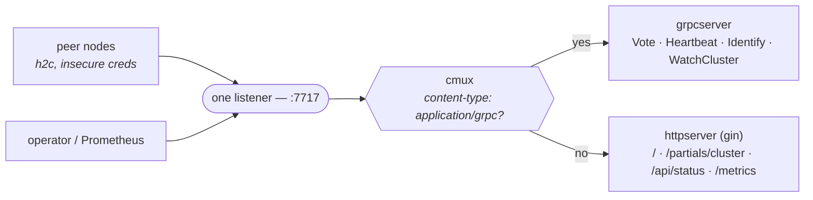

# warden — candacenet fleet watchdog

warden is a small daemon that runs on every node of the candacenet fleet and
watches the fleet for it. The nodes elect a leader among themselves; the leader
continuously checks that every other node is alive and **emails the operator
when a node dies** (and, optionally, when it recovers). Each node also serves a
live dashboard, a JSON status API, and Prometheus metrics on a single HTTP
port.

There is no central server: the same binary, with the same config, runs on all
four nodes. Whichever node currently holds leadership does the watching; if it
dies, the others elect a new leader and watching continues.

## Try it in three terminals

Three processes on one machine are a real three-node cluster — same binary,
same peer list, different ports and data directories. Quorum is 2, so you can
kill one and watch the remaining two carry on.

```bash
# from the Go module root
PEERS="n1=127.0.0.1:7717,n2=127.0.0.1:7727,n3=127.0.0.1:7737"

# terminal 1 — then repeat with n2/:7727 and n3/:7737
WARDEN_LOG_FORMAT=console WARDEN_NODE_ID=n1 WARDEN_BIND=:7717 \
  WARDEN_DATA_DIR=/tmp/warden-n1 WARDEN_PEERS="$PEERS" \
  WARDEN_NOTIFY_MODE=log go run ./app/warden/cmd
```

Then ask any node what it thinks the cluster is. Every node answers, and — once
a leader exists — every node answers the *same* thing, because followers serve
the leader's view rather than their own:

```bash
curl -s localhost:7717/api/status | jq '{self,role,leader_id,authoritative}'
curl -s localhost:7737/api/status | jq '{self,role,leader_id,authoritative}'
curl -s localhost:7717/metrics | grep -E '^warden_(is_leader|term)'
```

Ctrl-C one of the three. Within `dead_after` (15s by default) the leader
declares it dead and `WARDEN_NOTIFY_MODE=log` prints the incident it would have
emailed; Ctrl-C the *leader* instead and the other two elect a new one and keep
watching. Open <http://127.0.0.1:7717/> for the same state as a dashboard —
its assets are embedded in the binary, so it works with no network at all.

Swap `WARDEN_NOTIFY_MODE=file WARDEN_NOTIFY_FILE=/tmp/warden-incidents.jsonl`
to `tail -f` incidents instead of reading them out of the log.

## Architecture

### Leader election (Raft-style, no log)

warden uses Raft's leader-election half — **terms and votes** — but none of its
log replication. There is no replicated state machine to keep consistent; the
only thing the cluster needs to agree on is *who is the leader right now*.

- Each node persists its `current_term` and the vote it cast in that term
  (`<data_dir>/state.json`). Persisting the vote means a node can never vote
  twice in the same term, even across a restart.
- A follower that hears no heartbeat within a randomized election timeout
  becomes a candidate, bumps the term, and requests votes.
- A candidate that collects a **majority quorum** (`n/2 + 1`, counting its own
  vote) becomes leader for that term.

### Split-brain is impossible; a minority is leaderless by design

Because a leader needs a majority and a node votes at most once per term, **at
most one leader can exist per term** — two leaders would each need a majority,
and two majorities of the same set must overlap on at least one node, which
cannot have voted for both. So a network partition can never produce two
leaders issuing conflicting notifications.

The flip side is intentional: a **minority partition cannot elect a leader**
and stays leaderless until it can talk to a majority again. That is correct —
a minority cannot know whether the nodes it can't see are dead or merely
unreachable, so it must not appoint itself watchdog and start emailing. The
majority side elects (or keeps) a leader and keeps watching.

One nuance: if the **old leader itself** ends up in the minority, it keeps
*believing* it is leader until a higher term reaches it (no higher term can
form without a majority reaching it). It cannot do harm — it cannot commit
anything, and the majority side outvotes it — but its watchdog could
misread its isolation as fleet-wide death. The watchdog therefore carries an
**isolation guard**: death alerts require the leader to still observe a live
majority (itself plus `StatusAlive` peers ≥ quorum). Below that threshold it
suppresses alerts and logs, because "everyone died" and "I am cut off" are
indistinguishable from inside; alerting stays with the side that has quorum.

### One authoritative view, piggybacked on heartbeats

Only the leader tracks peer liveness authoritatively. To keep every node's
dashboard showing the *same* cluster state without extra gossip, the leader
attaches its authoritative `ClusterView` to each heartbeat. Followers cache the
most recent leader view (marked `authoritative: true`). If a node hasn't heard
a fresh leader view (leaderless, or partitioned away from the leader), it falls
back to its own local observations, marked `authoritative: false`.

### Transport: gRPC over HTTP/2, multiplexed with HTTP on one port

Node-to-node cluster RPCs — `Vote`, `Heartbeat`, `Identify`, and the
server-streaming `WatchCluster` — are gRPC methods on the
`candacenet.warden.v1.WardenService`. They share the node's single bound port
(default `:7717`) with the HTTP surface: a [cmux](https://github.com/soheilhy/cmux)
multiplexer routes HTTP/2 connections carrying `content-type: application/grpc`
to the gRPC server and every other connection to the HTTP/1.1 dashboard engine.



The transport is **h2c** (cleartext HTTP/2) with **insecure credentials**:
warden speaks only over the tailnet (WireGuard), which already authenticates
and encrypts node-to-node traffic, so warden terminates no TLS of its own —
exactly the trust model the previous HTTP/JSON transport relied on. Peer
connections are pooled one per peer and reconnect promptly on failure, so a
restarted node rejoins as a follower rather than self-electing.

> **Retired:** the earlier HTTP/JSON RPC transport (`POST /warden/v1/vote`,
> `POST /warden/v1/heartbeat`, `GET /warden/v1/identify`) and its JSON wire
> goldens were removed in the gRPC migration — a deliberate contract change.
> Wire compatibility is now carried by the Protocol-Buffers schema below and its
> `schema_contract_test.go`. The dashboard, `/api/status`, and `/metrics` remain
> HTTP and are unchanged.

### Wire schema (Protocol Buffers — source of truth for the gRPC plane)

`services/warden/proto/warden/v1/warden.proto` (package `candacenet.warden.v1`)
is now the
Protocol-Buffers source of truth for the node-to-node wire contracts. It mirrors
the frozen Go wire types 1:1 in field names and meaning and defines the
`WardenService` RPC surface the gRPC transport implements:

- unary `Vote` / `Heartbeat` / `Identify` — the existing endpoints. `Identify`
  takes an explicit (currently empty) `IdentifyRequest` rather than
  `google.protobuf.Empty`, so the handshake can grow request fields compatibly.
- server-streaming `WatchCluster(WatchClusterRequest) → stream ClusterViewUpdate`
  — a push watch for cluster-view/membership changes. Updates are **full
  snapshots, never diffs**: each carries the complete current `ClusterView`, so a
  client that drops or reconnects re-syncs from the next update with no replay
  bookkeeping. Updates are keyed by a `ClusterViewCursor` — the
  `(membership.version, membership.created_in_term, view.updated_at)` triple — for
  dedup and resume; `WatchClusterRequest.since` optionally suppresses a redundant
  initial snapshot.

Generated bindings (`warden.pb.go`, `warden_grpc.pb.go`) are committed. The
schema is gated by `buf lint` (STANDARD) and `buf breaking`; regenerate with
`go generate ./services/warden/proto/...`. See
[CLAUDE.md](CLAUDE.md#protobuf-wire-schema-source-of-truth-for-the-grpc-plane)
for the toolchain and gate commands.

When these messages are rendered with protobuf-JSON (protojson), canonical
output differs from today's `encoding/json` in inherent, documented ways: 64-bit
integers render as JSON strings (`"7"`), zero-valued scalars are omitted, proto
field names need `UseProtoNames` to stay snake_case, and timestamps follow
`google.protobuf.Timestamp` (RFC 3339, omitted when unset). The `warden.proto`
header enumerates each delta.

The durable election state file (`<data_dir>/state.json`) is written as this
schema's protojson (`UseProtoNames`, compacted) via the same conversion layer,
so the on-disk record and the wire share one source of truth. The read path
accepts BOTH the protojson form and the legacy `encoding/json` form written by
pre-migration binaries (proto3 JSON accepts a 64-bit field as a number or a
string), so an upgrade loads existing state losslessly.

### Concurrency model (CSP — why `go test -race` is clean by construction)

warden is written in the channel-first, single-owner style rather than
mutex-guarded shared state:

- The **election manager** and the **watchdog** are each a single event-loop
  goroutine that owns its own state. Nothing else touches that state directly.
- Handlers (RPC, dashboard, metrics, watchdog) interact with the manager by
  **sending a request on a channel and receiving a reply** — including
  `View()`, which returns an **immutable `ClusterView` snapshot** the caller
  may keep and read freely.
- The process lifecycle (`cmd/main.go`) is a channel-based supervisor:
  `context` cancellation flows *in* (an OS signal or a component failure),
  terminal errors flow *out* on a buffered channel, and every launched
  goroutine is awaited before exit. No mutexes, no `WaitGroup`-plus-shared-
  slice, no abandoned goroutines.

Because mutable state lives behind single owners and crosses goroutine
boundaries only as messages or immutable copies, the data-race detector has
nothing to find — that is a deliberate property of the design, not luck.

## Membership & discovery

warden starts from a **static peer seed** (`peers`) and can additionally learn
about nodes at runtime through a **discovery source**. Discovery is layered on
top of election without weakening any of its safety properties.

### The model: voters, observers, discovered

Every node warden knows about has one of three standings (`MemberKind`):

- **voter** — a full member. Counted in quorum, may vote, may lead. The voter
  set is the persisted `Membership`.
- **observer** — a node that discovery reported *and* that passed the identify
  handshake (it answered `/warden/v1/identify` with the same `cluster_id`). An
  observer receives heartbeats and the authoritative view so its dashboard is
  correct, but it **never votes, never counts toward quorum, and never starts
  elections**. It is a voter-in-waiting.
- **discovered** — a node the discovery source named but that has not (yet)
  been identify-verified as part of this cluster. It is a candidate only.

### Quorum is always over the persisted voter set

This is the invariant that makes discovery safe: **quorum is computed over the
`Membership.Voters` set — never over a discovery roster, and never over
"currently reachable peers."** A discovery source that goes quiet, an observer
that appears, or a voter that is unreachable **cannot change the quorum
denominator**. Split-brain remains impossible for exactly the reason it always
was: a leader needs a majority of the *voter set*, and a node votes at most once
per term.

### Membership changes: one at a time, leader-committed, after a settle

Only the **leader** changes membership, and only **one node at a time**
(single-server changes keep the old-majority and new-majority sets overlapping,
which preserves election safety). A change is not made the instant a node is
seen. The leader applies a **settle rule**:

- A discovered node must be **continuously present in the roster and identify-
  verified for `join_stability`** (default 30s) before the leader admits it as
  a voter. A node that comes and goes never accumulates enough continuous
  presence to be admitted — flaps cause no membership churn.
- Removal is governed by `remove_after`. The default (`0s`) means **warden never
  removes a voter automatically**; removal is a deliberate operator action.

A membership's identity is the **`(version, created_in_term)` pair**, not the
bare version: each committed change bumps `Membership.Version` and stamps the
minting leader's term into `created_in_term`. This closes the sibling-config
hole inherent to logless single-server changes — a leader that persists a new
version but is deposed before any follower receives it leaves behind a config
with the *same version number* the next leader will mint. Receivers adopt a
config when its pair is lexicographically newer (so the higher-term sibling
always supersedes the stale one), and the leader's settle accounting counts a
voter's ack only for the exact pair being settled — a voter holding a
divergent sibling is never mistaken for a committed one. Changes are
disseminated on heartbeats; receivers persist-then-adopt (only from the leader
they accept), so a restart resumes with the same voter set and the same
quorum denominator. Waiting for the settle before the next change is what
keeps consecutive configs one node apart, which is exactly the property that
makes the old/new majority overlap argument above hold.

### Joining the fleet (the joiner flow)

A brand-new node ships the **same config as every other node**: the `peers`
seed is the current fleet, and its own `node_id` is simply not in it. On start
it seeds its voter set from `peers`, runs as an **observer** (it is not in its
own voter set, so it never votes), and waits. The leader discovers it, verifies
it via identify, and after `join_stability` commits it as a voter — at which
point every node (including the joiner) adopts a `Membership` that now contains
it. Because the joiner is not in `peers`, it must tell the fleet where to reach
it: set `advertise_addr` (env `WARDEN_ADVERTISE_ADDR`) to this node's routable
`ip:port`. (A node already in `peers` ignores `advertise_addr`; its peer entry
is authoritative.)

### Discovery sources

Set `discovery.mode`:

- **`static`** (default, fail-safe) — no dynamic discovery; the `peers` seed is
  the membership and never changes. Add/remove nodes by editing config and doing
  a rolling restart.
- **`tailscale`** — poll the local `tailscaled` LocalAPI (unix socket) and
  select peers by ACL **tag** (`tailscale.tag`, e.g. `tag:candacenet`) and/or an
  anchored RE2 **hostname pattern** (`tailscale.host_pattern`); either matches
  when both are set. A selected peer's warden address is composed from its first
  tailscale IPv4 and this node's bind **port**. Offline peers are kept in the
  roster on purpose — a rebooting voter must not drop out of membership; liveness
  is the election manager's job, not the roster's.
- **`file`** — poll a JSON roster file whose shape is exactly warden's roster
  (`{"nodes":[{"id":"…","addr":"host:port"}, …]}`). This doubles as a **manual
  dynamic mode**: an operator (or an external tool) edits the file and warden
  picks up the change on the next poll.

In **every** dynamic mode the `peers` seed is still **required** — it is the
membership warden boots from before discovery has said anything.

### Four scenarios

1. **A new node appears.** Discovery reports it → the leader runs identify →
   it becomes an **observer** (visible on the dashboard, receiving heartbeats,
   not voting). After it has been continuously present for `join_stability`, the
   leader commits it as a **voter** (one-at-a-time, `Version` bumps). Quorum
   grows by exactly one at that commit — not before.
2. **A brief flap.** A node appears and disappears within `join_stability`. It
   never accumulates the required continuous presence, so it is **never
   admitted**. Membership and quorum are untouched; no churn, no elections.
3. **A permanent removal.** By default warden **never** removes a voter
   automatically (`remove_after: 0s`): the operator removes it by editing config
   (drop it from `peers`, or from the `file` roster) and doing a rolling
   restart. If you set a non-zero `remove_after`, the leader commits the removal
   after the voter has been absent from the roster for that long — but only while
   the leader still sees a **live majority** of the current voter set (the same
   isolation guard the watchdog uses), so a partition can never trick a node into
   shrinking the cluster.
4. **The discovery source is unavailable.** tailscaled is down, or the roster
   file is missing/garbled. The source logs a rate-limited warning and **sends
   nothing** — it never emits an empty or partial roster on error. Consumers keep
   the **last roster** and the **persisted membership**. Discovery failure
   therefore never removes anyone and never shrinks quorum; warden keeps running
   on the membership it already had. (A syntactically valid but *empty* roster —
   e.g. a file with `"nodes": []` — is a real empty roster and is honored; an
   error is not.)

## Endpoints

Every node serves all of these on its `bind` address (default `:7717`):

| Path                  | Kind             | Purpose                                             |
| --------------------- | ---------------- | --------------------------------------------------- |
| gRPC `WardenService/Vote`      | cluster RPC (gRPC) | RequestVote                                       |
| gRPC `WardenService/Heartbeat` | cluster RPC (gRPC) | Leader heartbeat carrying the authoritative view  |
| gRPC `WardenService/Identify`  | cluster RPC (gRPC) | Cluster-identity handshake                         |
| gRPC `WardenService/WatchCluster` | cluster RPC (gRPC, stream) | Push stream of full `ClusterView` snapshots |
| `/`                   | dashboard (SSR)  | HTMX cluster dashboard (offline-capable, embedded assets) |
| `/partials/cluster`   | dashboard (HTMX) | Cluster-table partial the dashboard polls           |
| `/api/status`         | JSON API         | Current `ClusterView` as JSON                       |
| `/metrics`            | Prometheus       | Metrics (below)                                     |

`/api/status` is a frozen shape, not an incidental serialization: pretty-printed
with a two-space indent because operators `curl` it, and `incidents` is `[]`
rather than `null` when the log is empty. This is the exact body
`services/warden/dashboard/dashboard_contract_test.go` pins — a leader that has
just declared one peer dead:

```json
{
  "view": {
    "self": "node-d",
    "role": "leader",
    "term": 7,
    "leader_id": "node-d",
    "source": "node-d",
    "authoritative": true,
    "updated_at": "2026-07-21T15:04:05Z",
    "peers": [
      {"node":{"id":"node-d","addr":"203.0.113.14:7717"},"status":"alive","last_seen":"2026-07-21T15:04:05Z","latency_ms":1.2},
      {"node":{"id":"node-a","addr":"203.0.113.11:7717"},"status":"dead","last_seen":"0001-01-01T00:00:00Z","latency_ms":0}
    ],
    "elections_started": 2,
    "membership": {"version":0,"created_in_term":0,"voters":null}
  },
  "incidents": [
    {"id":"peer_dead/node-a/1784646245","type":"peer_dead","peer":{"id":"node-a","addr":"203.0.113.11:7717"},"term":7,"reported_by":"node-d","detected_at":"2026-07-21T15:04:05Z","last_seen":"2026-07-21T15:04:05Z","message":"peer node-a declared dead"}
  ]
}
```

`source` is the field worth reading first: it names the node whose observations
produced `peers`. `source == leader_id` with `authoritative: true` is the
leader's own liveness tracking; `source == self` with `authoritative: false` is
this node guessing because no fresh leader view reached it.

## Metrics

Exposed at `/metrics`:

| Metric                    | Meaning                                                    |
| ------------------------- | ---------------------------------------------------------- |
| `warden_is_leader`        | 1 if this node is the current leader, else 0               |
| `warden_term`             | This node's current election term                          |
| `warden_elections_total`  | Elections this node has started since boot                 |
| `warden_peer_up`          | Per peer: 1 if alive, else 0                               |
| `warden_peer_status`      | Per peer + status label: liveness classification           |
| `warden_peer_latency_ms`  | Per peer: last heartbeat round-trip in milliseconds        |
| `warden_view_authoritative` | 1 if this node's view is the leader's authoritative view |
| `warden_membership_version` | Current membership config version on this node            |
| `warden_voters`           | Number of voting members in the current membership         |
| `warden_observers`        | Number of verified non-voting observers                    |
| `warden_discovered`       | Discovered candidates not yet verified/admitted            |
| `warden_peer_member`      | Per peer + member label: one-hot membership kind           |

The cluster-scoped membership gauges are deliberately unlabeled (same
convention as `warden_view_authoritative`): each node serves its own
`/metrics`, so Prometheus `instance` labels already disambiguate nodes.

## Configuration reference

Precedence: **built-in defaults → YAML file → environment** (env wins). See
[`warden.example.yaml`](warden.example.yaml) and [`.env.example`](.env.example)
for annotated copies.

| YAML key                     | Env var                        | Default             | Description |
| ---------------------------- | ------------------------------ | ------------------- | ----------- |
| `node_id`                    | `WARDEN_NODE_ID`               | *(none)*            | This node's id; must be in `peers`. |
| `bind`                       | `WARDEN_BIND`                  | `:7717`             | HTTP listen address. |
| `data_dir`                   | `WARDEN_DATA_DIR`              | `/var/lib/warden`   | Election state at `<data_dir>/state.json`. |
| `peers`                      | `WARDEN_PEERS`                 | *(none)*            | Member SEED (incl. self); env form `id=host:port,...`. **Required** — warden compiles in no fleet — and required even in dynamic discovery modes. |
| `advertise_addr`             | `WARDEN_ADVERTISE_ADDR`        | *(= `bind`)*        | This node's routable `ip:port`. Only used by a discovery-mode joiner whose `node_id` is not yet in `peers`; then it must have a real host. |
| `log_level`                  | `WARDEN_LOG_LEVEL`             | `info`              | `debug`\|`info`\|`warn`\|`error`. |
| *(n/a)*                      | `WARDEN_LOG_FORMAT`            | *(json)*            | `console` for human logs; else JSON. |
| *(n/a)*                      | `WARDEN_CONFIG`                | *(none)*            | Default `-config` path. |
| `timing.heartbeat_interval`  | `WARDEN_HEARTBEAT_INTERVAL`    | `1s`                | Leader→peer heartbeat cadence. |
| `timing.suspect_after`       | `WARDEN_SUSPECT_AFTER`         | `5s`                | Silence before a peer is `suspect`. |
| `timing.dead_after`          | `WARDEN_DEAD_AFTER`            | `15s`               | Silence before a peer is `dead` (raises incident). |
| `timing.election_timeout_min`| `WARDEN_ELECTION_TIMEOUT_MIN`  | `1500ms`            | Election timeout lower bound. |
| `timing.election_timeout_max`| `WARDEN_ELECTION_TIMEOUT_MAX`  | `3s`                | Election timeout upper bound. |
| `timing.rpc_timeout`         | `WARDEN_RPC_TIMEOUT`           | `500ms`             | Per-RPC timeout. |
| `watchdog.cooldown`          | `WARDEN_COOLDOWN`              | `10m`               | Min gap between repeat notifications per peer. |
| `watchdog.notify_recovery`   | `WARDEN_NOTIFY_RECOVERY`       | `true`              | Also notify on recovery. |
| `watchdog.max_incidents`     | *(n/a)*                        | `100`               | Incidents kept in memory for the dashboard. |
| `discovery.mode`             | `WARDEN_DISCOVERY_MODE`        | `static`            | `static`\|`tailscale`\|`file`. See Membership & discovery. |
| `discovery.cluster_id`       | `WARDEN_CLUSTER_ID`            | `candacenet`        | Cluster identity for the identify handshake. |
| `discovery.join_stability`   | `WARDEN_JOIN_STABILITY`        | `30s`               | Continuous presence before the leader admits an observer as a voter. |
| `discovery.remove_after`     | `WARDEN_REMOVE_AFTER`          | `0s`                | Absence before leader-committed removal; `0s` = never auto-remove. |
| `discovery.file`             | `WARDEN_DISCOVERY_FILE`        | *(none)*            | Roster path for `mode=file` (`{"nodes":[{"id","addr"}...]}`). Doubles as a manual dynamic mode. |
| `discovery.file_poll_interval`| `WARDEN_FILE_POLL_INTERVAL`   | `2s`                | Roster-file re-read cadence for `mode=file`. |
| `discovery.tailscale.socket` | `WARDEN_TS_SOCKET`             | `/var/run/tailscale/tailscaled.sock` | tailscaled LocalAPI unix socket. |
| `discovery.tailscale.tag`    | `WARDEN_TS_TAG`                | *(none)*            | Select peers advertising this ACL tag (`mode=tailscale`). |
| `discovery.tailscale.host_pattern`| `WARDEN_TS_HOST_PATTERN`  | *(none)*            | Anchored RE2 pattern matched against peer HostName; tag OR pattern. |
| `discovery.tailscale.poll_interval`| `WARDEN_TS_POLL_INTERVAL` | `15s`               | tailscaled status poll cadence. |
| `notify.mode`                | `WARDEN_NOTIFY_MODE`          | `smtp` if host set, else `log` | `smtp`\|`log`\|`file`. |
| `notify.file`                | `WARDEN_NOTIFY_FILE`           | *(none)*            | Incident sink path for `mode=file`. |
| `notify.smtp_host`           | `SMTP_HOST`                    | *(none)*            | SMTP server host. |
| `notify.smtp_port`           | `SMTP_PORT`                    | `587`               | SMTP server port. |
| `notify.smtp_user`           | `SMTP_USER`                    | *(none)*            | SMTP username. |
| *(never in YAML)*            | `SMTP_PASS`                    | *(none)*            | SMTP password / Gmail app password. Env only. |
| `notify.smtp_from`           | `SMTP_FROM`                    | *(none)*            | Envelope/from address. |
| `notify.smtp_to`             | `SMTP_TO`                      | *(none)*            | Recipients; env form is comma-separated. Required for `mode=smtp`. |

Validated at startup: peers non-empty with unique ids and `host:port`
addresses; all durations `> 0`; `election_timeout_min < election_timeout_max`;
`heartbeat_interval < suspect_after < dead_after`; `notify.mode=smtp` requires
host/from/to; `notify.mode=file` requires a file. `SMTP_PASS` is **not**
required (IP-allowlisted relays need none).

Discovery validation: `discovery.mode` ∈ {`static`,`tailscale`,`file`};
`cluster_id` non-empty; `join_stability > 0`; `remove_after >= 0`; poll
intervals `> 0`; `mode=tailscale` requires `tag` or `host_pattern`;
`mode=file` requires `file`; any `host_pattern` must be a valid RE2 pattern.
The `node_id`-must-be-in-`peers` rule holds in **static** mode; in a dynamic
mode a `node_id` absent from `peers` is a joiner and instead requires a routable
`advertise_addr`.

Two derived timings have no config knob and are computed in `cmd/main.go`:
`ViewFreshFor = dead_after` (how long a follower trusts the leader's cached
view) and the watchdog `CheckInterval = heartbeat_interval` (how often it
re-evaluates liveness).

## Deployment quickstart

### Docker (single node)

`docker-compose.warden.yaml` is a file of the canonical monorepo, which keeps
it beside its other Compose stacks rather than inside this export root; the
paths below are relative to that repository. To run warden from a clone of
*this* repository instead, build the image directly (next block) and run it.

```bash
cp candace/app/warden/.env.example .env      # then edit: WARDEN_NODE_ID, SMTP_*
mkdir -p warden/data && sudo chown 65532:65532 warden/data  # see below
docker compose -f docker-compose.warden.yaml up -d --build
docker compose -f docker-compose.warden.yaml logs -f warden
```

The `chown` step matters: the runtime image is distroless `:nonroot` (a fixed
uid `65532`, no shell to fix this at container start), and `./warden/data` is
a host bind mount, not a named volume, so Docker does not apply the image's
ownership to it — if the directory doesn't already exist, the daemon creates
it as `root:root`. Skipping this step means the very first election `Save`
(`<data_dir>/state.json`) fails with permission denied and the node can never
persist a term/vote.

Build the image directly (the build context is the Go module root, which is
this repository's root):

```bash
docker build -f app/warden/Dockerfile \
  --build-arg VERSION="$(git describe --tags --always --dirty)" \
  -t warden:latest .
```

### systemd (the fleet)

See [`deploy/README.md`](deploy/README.md) for the full four-node walkthrough
(build once, `scp`, install the unit, per-node config, `systemctl enable
--now`, verification curls). In short:

```bash
# from the Go module root
CGO_ENABLED=0 GOOS=linux GOARCH=amd64 \
  go build -trimpath -ldflags "-s -w -X main.version=$(git describe --tags --always --dirty)" \
  -o /tmp/warden ./app/warden/cmd
# scp to each node, install /usr/local/bin/warden + /etc/warden/warden.yaml + the unit
sudo systemctl enable --now warden
```

## Email notifications (Gmail)

For Gmail delivery:

- Host `smtp.gmail.com`, port `587` (STARTTLS).
- Enable 2-Factor Auth on the Google account, then create an **App Password**
  (Google Account → Security → App passwords). Use that 16-character app
  password as `SMTP_PASS` — a normal account password will be rejected.
- Set `SMTP_USER` and `SMTP_FROM` to the Gmail address; `SMTP_TO` to the
  operator recipient(s).
- Keep `SMTP_PASS` in the environment (`/etc/warden/warden.env` or the compose
  `.env`), never in `warden.yaml`.

## Troubleshooting

- **No leader / constant re-elections.** Usually connectivity: confirm every
  node can reach every other node's `:7717` over the tailnet
  (`curl -s http://<peer-ip>:7717/api/status`). Also check **clock skew** —
  large skew across nodes distorts the liveness timers; keep NTP healthy. If
  election timeouts are tuned too tight relative to real RPC latency, widen
  `election_timeout_min/max`.
- **Tailscale down.** warden dials peers by tailnet IP; if `tailscaled` is
  stopped the node can neither reach peers nor be reached, so it drops out of
  the fleet. `tailscale status` should list the other nodes. The systemd unit
  orders warden `After=tailscaled.service`.
- **Port conflict on 7717.** `ss -ltnp | grep 7717` (or `lsof -i :7717`). With
  `network_mode: host` in Docker the container binds the host's `:7717`
  directly, so a host process already on 7717 will collide. Change `bind` /
  `WARDEN_BIND` or free the port.
- **No emails on a real death.** Verify `notify.mode=smtp` and the SMTP settings
  resolve (the startup log prints `notify_mode`); check `journalctl -u warden`
  for delivery errors. Remember the **cooldown** (default 10m) suppresses repeat
  notifications for the same peer, and only the **leader** notifies — check
  which node is leader (`warden_is_leader 1`).
- **Every node shows `authoritative: false`.** No fresh leader view is
  reaching them — either the cluster is leaderless (see the first item) or this
  node is partitioned away from the leader.

### Alerting semantics worth knowing

- **Per-episode, per-leader dedup.** Exactly one death email per continuous
  outage, deduplicated in the acting leader's process. A leadership change
  during an ongoing outage can produce a fresh alert from the new leader once
  the cooldown allows — dedup state is not replicated between leaders (by
  design: no shared state, no log replication).
- **Ordering under rapid flapping.** Death and recovery emails are sent
  asynchronously and independently; if a peer flaps faster than SMTP delivery
  completes, a recovery email can occasionally arrive before the death email
  it answers. The incident log on the dashboard is always in true order.
- **Isolated leader = silence, not false alarms.** A leader that stops seeing
  a live majority (itself + alive peers ≥ quorum) suppresses death alerts:
  from inside, fleet-wide death and its own isolation look identical, and the
  far more likely explanation is that this node is the cut-off one. The
  suppression is logged, the dashboard still shows the (non-quorate) view,
  and alerting resumes automatically when a majority is visible again or a
  new leader (on the majority side) takes over. Consequence: warden never
  emails about a *true* simultaneous majority outage — pair it with an
  external uptime check if that case matters to you.

## Layout

```
app/warden/                 # the runnable composition
├── cmd/main.go             # process wiring + CSP supervisor
├── e2e/                    # whole-binary cluster tests
├── deploy/                 # systemd unit + fleet install guide
├── warden.example.yaml     # annotated config
├── .env.example            # annotated environment
└── Dockerfile              # multi-stage, distroless runtime

services/warden/            # the reusable service packages
├── warden/                 # FROZEN contract: types, wire protocol, interfaces
├── config/                 # YAML + env configuration loading
├── discovery/              # IPeerDiscoverer sources: static, tailscale, file
├── election/               # election state machine + liveness + membership
├── wireconv/               # domain <-> candacenet.warden.v1 conversions
├── grpcserver/             # WardenService server: unary RPCs + WatchCluster
├── grpcmux/                # single-port cmux: gRPC (h2c) + the HTTP engine
├── grpctransport/          # gRPC client implementing warden.ITransport
├── httpserver/             # the gin engine the HTTP surface is served from
├── store/                  # durable PersistentState (file)
├── testclock/              # deterministic fake clock for tests
├── watchdog/               # leader-only incident engine (dedup + cooldown)
├── notify/                 # INotifier impls: SMTP, log, file
├── dashboard/              # SSR dashboard (HTMX, embedded assets) + JSON API
├── metrics/                # Prometheus collectors + /metrics
├── proto/warden/v1/        # protobuf schema + committed Go/gRPC bindings
└── internal/mocks/         # generated gomock doubles, for warden's own tests
```
