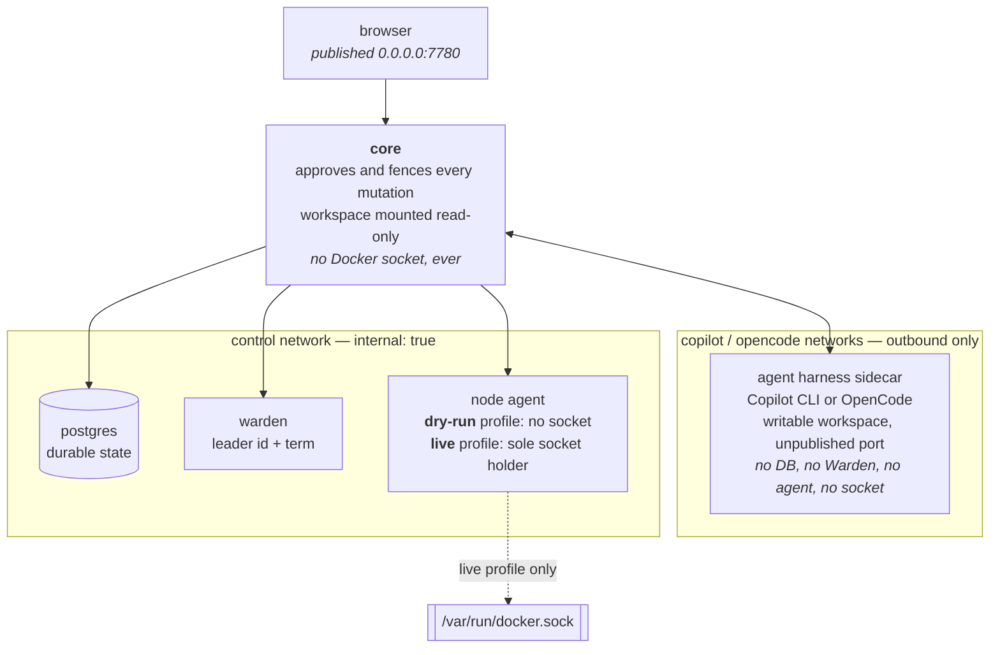

# CandaceOS prototype

CandaceOS turns one Linux box into a private agent-operated app lab with a
local visual control plane. The default install is deliberately harmless: it
runs the demo harness and makes the node executor run Compose's
read-only configuration preflight, then return the exact mutation plan without
executing it.

## The one-box shape

Three Compose networks, declared in [`compose.yaml`](compose.yaml) rather than
argued for here. The `control` network is `internal: true` — no internet route,
no published port — and Core is its only user-facing mediator:



The default `./install.sh` starts the `dry-run` profile, so the socket edge in
that diagram does not exist in the running project at all — not mounted
read-only, not mounted at a different path, absent. Turning it on takes two
flags and a typed confirmation phrase, and even then it lands on the node agent
and nowhere else.

## Quick start

Requirements: Linux, Git, Docker Engine with Compose v2.20 or newer, and
OpenSSL.

```bash
./install.sh
```

Every command in this document is written for this directory. It is a
subdirectory in both of its homes — `candaceos/` in the private staging
`candacelabs/csf_staging`, and `candace/candaceos/` in the canonical monorepo — so
run them from here, or prefix each path accordingly.

Open `http://<host-ip>:7780` directly. Core is published on all host IPv4
interfaces and has no built-in UI login or passcode; any client that can reach
the listener can operate it. Browser mutations still reject cross-origin
requests. `./install.sh` is safe to run again and preserves materialized values
in its mode-600 `.env`. It prints the address only after the Core health
endpoint and its durable database are ready.

| Invocation | Agent harness | Executor | Host Docker socket |
|---|---|---|---|
| `./install.sh` | simulated | dry run | absent |
| `./install.sh --copilot` | official CLI 1.0.80 | dry run | absent |
| `./install.sh --copilot --live-executor` | official CLI 1.0.80 | live | agent only |
| `./install.sh --opencode` | pinned OpenCode 1.18.21 sidecar | dry run | absent |
| `./install.sh --opencode --live-executor` | pinned OpenCode 1.18.21 sidecar | live | agent only |

`CANDACEOS_HARNESS_BACKEND=demo|copilot-cli|ollama|opencode` is the canonical Core selector.
Bare Core defaults to `copilot-cli`; the safe local installer and Compose stack
explicitly select `demo`, while fleet deployment defaults to `copilot-cli` and
accepts `--harness ollama`. OpenCode is currently a local prototype backend;
the fleet lifecycle remains an explicit later milestone.
Legacy `CANDACEOS_MODE=demo|copilot` is normalized only while
loading configuration and is rejected when it conflicts with the canonical
selector.

`CANDACEOS_FLEET_POLL_INTERVAL` defaults to `2s`. The same value is validated
as the Liquid Proto persistence-timing primitive; Core derives its durable
write, ambiguous-commit read-back, checkpoint, and retry cadences from it
rather than maintaining independent runtime literals.

## One environment owner

A single upstream environment contract - names, defaults, profiles, the
secret/host/operator lifecycle, and per-service projections - is the only
authored definition of the one-box environment. `.env.example`,
`environment.generated.sh` (the shell symbols and materializer), and
`compose.environment.generated.yaml` are checked-in projections of it, together
with Core's Go symbols and defaults. Edit them only by regenerating them
upstream; the generator itself is part of the canonical monorepo and is not
included here. `compose.yaml` owns container structure only; every command that
reconstructs the project layers the generated overlay on it.

The ignored runtime `.env` is data, not policy. The installer never sources it
and atomically rewrites exactly the secret, host, and explicit operator values
declared by `Candacefile`; policy defaults and the pass-through provider API
keys (`OPENAI_API_KEY`, `ANTHROPIC_API_KEY`, `OPENROUTER_API_KEY`) are not
persisted there. `COPILOT_GITHUB_TOKEN` is the exception: it is declared
operator state rather than a pass-through credential, so it is retained in that
mode-600 file. Values containing whitespace, `#`, `$`, quotes, or backslashes
are rejected because Docker Compose env files can reinterpret those
characters. Use paths without those characters and pass provider credentials in
the invoking process environment.

## Compile in another agent harness

The built-in Copilot CLI, Ollama, demo, and OpenCode adapters are defaults, not
a closed plugin list. A custom Go binary can replace the harness through
`services/candaceos/harness` and compose its own ordered services through
`services/candaceos/component`, while retaining Core's Warden view, PostgreSQL
state, approval queue, reconciliation, receipts, HTTP API, and Web UI:

```go
if err := bootstrap.Run(
	"dev",
	bootstrap.WithComponent(steeringStore),
	bootstrap.WithComponent(steeringService),
	bootstrap.WithHarnessFactory(myharness.New(steering.Instance())),
); err != nil {
	panic(err)
}
```

`services/candaceos/component` is the second compile-time boundary: a definition
names a service the embedding repository already owns and declares the other
definitions it requires by pointer identity, and Core resolves its own built-in
steps together with every registered component into one topologically ordered
bring-up list, assembling each before the harness is constructed, starting each
before the harness starts, and stopping each in reverse after it closes.

The same composition root rebrands the operator UI. `bootstrap.WithBrand` takes
one `webui.Brand` — product name, agent name, wordmark, and the design tokens
the stylesheet declares on `:root` — and Core reads it in two places: the names
travel in every snapshot it produces, and the web UI renders the wordmark and
serves the palette as a generated same-origin stylesheet. The zero brand is the
stock identity, only brand-bearing strings become data, the `/claws/...` routes
are unchanged, and the page keeps its `'self'` Content-Security-Policy because
nothing is inlined. See [the extension guide](../docs/extending.md) for the
palette rules and the wordmark's trust boundary.

Two further options widen that seam without moving a route.
`bootstrap.WithNavItem` appends an entry to the operator sidebar — a plain link
to something the embedding product already serves — after Core's own Home, Apps,
Fleet, and Activity. `bootstrap.WithUIOverlay` takes one filesystem shaped like
the web UI's own, with `templates/` and `assets/` subtrees resolved
overlay-first and embedded-fallback, so an overlay redefines the named blocks
and replaces the assets it names and nothing else. Overlay assets keep the one
asset URL space and its cache headers, and the overlay cannot reach outside
`assets/` through that route. The extension guide lists every overridable block, the
data each receives, and which of them the browser client depends on.

The harness receives only typed Liquid Proto events, fleet observations, and
approval-bound reconcile calls. It identifies its capabilities explicitly, so
the UI does not infer behavior from a provider name. The stock command uses
the same composition root and opts into raw operator diagnostics with
`WithPII`; embedding binaries retain configuration-derived secret redaction
unless they explicitly choose that option.

`tools/package_candace_archive.sh` in the monorepo builds that immutable
source archive out of the whole public export root, and
[`examples/external-consumer`](../examples/external-consumer) is the worked
consumer: it fetches the archive with Bazel, implements the Go interfaces, and
compiles its own Core binary without a fork or a mirrored source tree.

That external checkout does not need a CandaceOS source tree of its own. Its
Bazel target emits one Linux Core executable; from a canonical monorepo
checkout pinned to the same export commit, the complete fleet deployment is:

```bash
./fleet.sh deploy --harness custom \
  --core-binary /absolute/path/to/bazel-bin/cmd/custom-candaceos \
  --core-export-revision <full-40-character-export-commit>
```

The deployer snapshots and hashes the executable, layers it over the standard
Core runtime, and records both its SHA-256 and export revision in the receipt.
It refuses a custom binary built from a different CandaceOS commit, so Core,
Warden, and the node agents advance as one compatible release. No provider
credential, external source checkout, or custom image registry is required.

Real Copilot mode prompts invisibly for a supported GitHub Copilot token. For
non-interactive installation, inherit `COPILOT_GITHUB_TOKEN`, `GH_TOKEN`, or
`GITHUB_TOKEN`, or set `COPILOT_GITHUB_TOKEN` in the mode-600 `.env`. If none
is set, the installer automatically inherits an authenticated host `gh` login.
Because `COPILOT_GITHUB_TOKEN` is operator state, a value already in `.env` or
exported into the installer is rewritten into that mode-600 file and reused by
later runs, while a token discovered from `GH_TOKEN`, `GITHUB_TOKEN`,
`gh auth token`, or the interactive prompt is used only for the run that
discovered it. The selected credential is supplied to Copilot CLI, GitHub CLI,
and Git's GitHub credential helper, so the agent can commit, push, and use `gh`
from the same workspace. GitHub documents the supported order in
[Authenticating GitHub Copilot CLI](https://docs.github.com/en/copilot/how-tos/copilot-cli/set-up-copilot-cli/authenticate-copilot-cli).
CandaceOS follows GitHub's [external headless CLI pattern](https://docs.github.com/en/copilot/how-tos/copilot-sdk/setup/backend-services)
without shipping a Copilot image. `install-copilot.sh` reuses the exact
official host binary when available or verifies both the pinned Linux x64
release archive and extracted binary before placing it in digest-addressed,
user-owned state. Both the one-box and fleet installers use that same script.

Live execution requires two flags plus an exact interactive confirmation. The
Docker socket is host-root-equivalent. Core and Copilot never receive it.

## OpenCode interactive prototype

`./install.sh --opencode` builds the reviewed OpenCode `v1.18.21` Linux x64
release from its upstream archive and published SHA-256, then runs
`opencode serve` in a separate private container in the same Compose project.
OpenCode owns the agent, model, and tool loop. The browser talks only to Core at
the published `0.0.0.0:7780` listener; the OpenCode port and Basic-auth
credential are never published. OpenCode gets the writable app workspace and
its own persistent state, but no PostgreSQL, Warden, node-agent network, or
Docker socket.

Select an explicit OpenCode `provider/model` and give the sidecar a provider
credential only in the invoking environment. The model selection is operator
state in the ignored mode-600 `.env`; provider credentials are pass-through and
are never written there.
A fresh OpenCode server has no reliable provider-neutral default, so Core does
not guess one. For example:

```bash
OPENROUTER_API_KEY='...' \
  CANDACEOS_OPENCODE_MODEL='openrouter/openai/gpt-5.4-nano' \
  ./install.sh --opencode
```

OpenCode's own persistent authentication flow is also available from the
Compose project when a provider requires OAuth. Do not commit the resulting
state or credentials.

The root-owned managed OpenCode policy permits workspace reads/edits and the
repository's ordinary build/test/status commands. It denies external-directory
access and other shell commands, and a project-local config cannot override it.
That policy is defense in depth, not the sandbox: the container and its mounts
are the hard boundary, the app workspace is intentionally writable, and the
sidecar has neither the Docker socket nor a route to the control network. Use a
scoped provider credential and keep secrets out of the workspace; a credential
available to the OpenCode process is not isolated from code it runs. The first
prototype deliberately does not turn an OpenCode permission prompt into a
silent approval.

Click the current Claw run to open its addressable chat. While work is active,
`Send after current` is an ordered follow-up; `Steer now` applies guidance using
the harness provider's native active-turn semantics. Copilot interjects into its
active work. OpenCode does not yet provide a supported soft mid-turn injection
API, so its implementation aborts the active OpenCode turn before submitting
the replacement. Candace owns those queue, provider-specific steering,
normalized-event, and run-fencing semantics. The current mappings and prompt
queue are in memory, so a Core restart does not yet provide durable replay.

### Disposable Claw chat acceptance

Run the repeatable no-credential gate from this repository's root:

```bash
./test-claw-chat.sh
```

The black-box phase starts a unique disposable Compose project with a
demo-backed Core and the real pinned OpenCode server as a separate private
sidecar. It proves the dashboard-to-chat link, SSE transcript, reconnect
snapshot, exact-run abort, stale-run fence, Core's container-network listener,
and the sidecar's lack of a published port. The official SDK contract checks
server health and events, creates and reads a session, accepts an asynchronous
prompt into the generated message unions, and aborts it. No provider credential
is passed, so this does not claim a completed provider turn. Enqueue ordering
and immediate abort-then-replacement behavior run against the fake-provider
OpenCode package suite. Live-provider and real-browser proof remain deployment
acceptance.

## Apps are just Compose directories

Each app is a directory below `apps/` containing a Compose file. The checked-in
`hello` example has service name `hello`, project name
`candaceos-hello`, and path `hello` — and it is the whole app, two files:

```text
apps/hello/
├── compose.yaml
└── index.html
```

```yaml
# apps/hello/compose.yaml
services:
  hello:
    image: busybox:1.37.0@sha256:9db7b59979c38555a39def84a31fb98b5296952f9e3afd4f6f11f05b07adfab0
    restart: unless-stopped
    user: "65534:65534"
    read_only: true
    cap_drop: [ALL]
    security_opt: [no-new-privileges:true]
    command: [httpd, -f, -p, "8080", -h, /www]
    volumes:
      - ./index.html:/www/index.html:ro
    ports:
      - 127.0.0.1:18080:8080
```

Nothing in it is CandaceOS-specific: it is an ordinary Compose file, and a live
assignment runs only:

```text
docker compose ... config --quiet
docker compose ... up -d --remove-orphans hello
```

The agent never runs `down`, deletes volumes, changes the host firewall, or
edits Docker daemon settings. The example would be reachable only on
<http://127.0.0.1:18080> after an explicitly approved live assignment.
The installer initializes `apps/` as a local `main` Git repository and
commits only the checked-in hello app when no `HEAD` exists. It never replaces
an existing repository or history. The demo node advertises
`environment=prototype` and `runtime=compose`, so label placement can be tried
without inventing another node.

Verified revision snapshots are bounded to 128 entries and 4 GiB by default;
override `CANDACEOS_AGENT_REVISION_MAX_ENTRIES` or
`CANDACEOS_AGENT_REVISION_MAX_BYTES` when installing. A full cache keeps
existing snapshots usable but rejects new revisions. Because a live app may
bind-mount a snapshot, cleanup is deliberately manual: stop reconciliation and
the agent, remove only unused directories below the configured revision root,
then restart it.

## Operations

```bash
./status.sh
./uninstall.sh
```

Uninstall removes only prototype containers and networks. PostgreSQL data,
receipts, app files, runtime state, and `.env` remain. Remove them manually
only when their loss is intentional.

## Three-node fleet

The production-shaped fleet uses the same Core, Warden, and node-agent
primitives as the local prototype, with Copilot CLI as its default harness.
Previewing is credential-free and performs no SSH, Docker, filesystem, or
credential reads:

```bash
./fleet.sh plan
```

From the GPU worker, where the Docker builder and current prototype live, the
complete installation is one command. Fleet deployment additionally requires
`rsync` on the invoking host and both remote hosts:

```bash
./fleet.sh deploy
# Same Core UI and control path with the bounded native fleet tools:
./fleet.sh deploy --harness ollama
# Or install a compiled-in harness from an external Bazel consumer:
./fleet.sh deploy --harness custom \
  --core-binary /absolute/path/to/custom-candaceos \
  --core-export-revision <full-40-character-export-commit>
```

| Node id | Placeholder target | Role | Published ports |
|---|---|---|---|
| `control` | `operator@203.0.113.10` | fixed control host | Core `7780`, Warden `7717`, and Git source `9418` on its own address |
| `worker-gpu` | local there, otherwise `operator@203.0.113.11` | worker, `gpu=true` | Warden `7717`, live agent `8094`; Ollama `11434` when selected |
| `worker` | `operator@203.0.113.12` | worker | Warden `7717`, live agent `8094` |

Those ids and addresses are documentation placeholders, not a deployable fleet.
Real targets come from `--control-target/--ai-target/--prod-target`, the
matching `--control-ip/--ai-ip/--prod-ip` and `--control-id/--ai-id/--prod-id`
flags, the equivalent `CANDACEOS_*` variables, or a topology file at
`fleet/topology.local.env`. The port numbers are product defaults and do not
change with the topology.

Core has no built-in authentication. If you expose it beyond an already trusted
network, put it behind your own authenticating reverse proxy.

The control node runs the singleton Core/control stack. Warden's leader remains
a dynamic three-voter quorum decision and may be any node. Labels describe only
declared facts: the control node has `role=control`, both workers have
`role=worker`, and the GPU worker also has `gpu=true`. Ordinary apps select
`role=worker`; exact-node and leader placement remain explicit operator
choices. Core leaves `CANDACEOS_AGENT_URL` empty and derives a selected node's
agent endpoint from its Warden address plus port 8094.

The deploy command requires a clean, pushed source revision. It builds each
release-tagged CandaceOS image once on the invoking host and never builds on
the control node. Each remote role keeps one uncompressed Docker archive below
`image-cache/`; rsync compares the next archive against that stable basis and
transfers rolling block deltas, retaining resumable partials without changing
the currently loaded images. The first transfer is necessarily complete. A
node checks the complete archive SHA-256 before `docker load`, then the deployer
checks every loaded image's canonical runtime fingerprint before any live
writer is stopped. The Copilot CLI is not packaged as a CandaceOS image: the
installer reuses an exact compatible host binary or checksum-installs pinned
CLI 1.0.80 below the user-owned fleet state, then bind-mounts that binary
read-only into the isolated Copilot sidecar. Per-user state, the two bounded
role caches, and immutable release directories live below
`~/.local/share/candaceos-fleet`; no existing checkout, unrelated Compose
project, firewall, Tailscale ACL, systemd unit, or Docker daemon setting is
changed. All targets, IPs, and the home-relative state root have command-line
overrides.

`--harness ollama` does not install or start Copilot and does not read or
require GitHub/Copilot credentials. It pulls the manifest-pinned official
Ollama 0.20.4 image directly on the GPU worker, persists models below the fleet
state root, and pulls `qwen3:8b`. Before Core activates, a bounded warm-up must
prove the model is tool-capable, loaded at the configured context, and fully
resident in GPU memory. The observed model digest, model/context policy, image
reference, and image digest are recorded in the immutable release evidence and
operator receipt. Neither the Ollama image nor its model is sent to the
control node or the non-GPU worker.

On first cutover, the command discovers the running legacy `/workspace`, stops
the updater and writers, and takes consistent Git and PostgreSQL snapshots. The
Copilot backend additionally inherits its nonempty token without printing it
and snapshots durable Copilot/Core runtime. The Ollama backend never reads
those credentials or packages that runtime; its model is already pulled,
warmed, and verified before cutover begins. The command restores and
fingerprints PostgreSQL on the control node before Core starts. The old
containers, volume, state, and dirty infrastructure checkout remain intact for
rollback.
Upgrades reuse the current control state and app repository, back up the
database, advance workers first, and cut the singleton control stack over last.

Success requires Core health, the exact Git source HEAD, both authenticated
live-agent identities, and three authoritative Warden views agreeing on one
term, leader, voter/address set, and three alive peers. The command prints the
UI URL plus a mode-600 receipt containing its exact rollback and the host
Copilot binary path and digest, or the selected Ollama image/model evidence.

Deploy and rollback serialize through `receipt_root/operator.lock`. Before any
service stops, the installer fsyncs a mode-600 cutover journal. After an
interruption, rerun from the same operator account or with the same
`CANDACEOS_FLEET_RECEIPT_ROOT`. This is an operator-side
serialization/recovery boundary, not a distributed lock.

```bash
./fleet.sh status
./fleet.sh rollback ~/.local/state/candaceos-fleet/receipts/RELEASE.receipt
```

## Deploy after merge

The on-prem bootstrap node can follow exact revisions of a deployment
repository's `main` branch without a privileged general-purpose Actions runner.
Set `CANDACEOS_REPOSITORY` to that `owner/name`; it is required and has no
default. From the healthy bootstrap-node checkout, run once:

```bash
./bootstrap-updater.sh
```

The bootstrapper inherits the host's authenticated `gh` credential into a
mode-600 credential file, briefly quiesces the current stack while adopting
its `.env`, app workspace, and file-backed runtime, then restarts the same
Copilot plus dry-run mode from the external state root. A failed adoption
restores the original state root. It then starts a separate `candaceos-cd`
Compose project. The updater runs with the
operator UID/GID plus only the Docker socket's supplementary group. It polls
the configured repository for exact `main` commit IDs. Before this deployment
contract exists on `main`, it remains armed and leaves the current stack alone.

After the merge that introduces CandaceOS, and after later relevant merges, it
checks out the exact `main` revision in its managed checkout and runs real
Copilot mode with the dry-run executor. Mutable `.env`, app Git history, and
runtime state live under the external deploy root rather than the checkout.
The updater verifies the loopback health endpoint and all five required
services before advancing its revision receipt. A failed candidate is marked
on GitHub, rolled back to the exact previously recorded revision, reverified,
and retried from durable per-revision state after 60 seconds with exponential
backoff capped at one hour. Retries continue until the candidate succeeds or a
new `main` revision supersedes it.

```bash
./updater-status.sh
docker logs -f candaceos-updater
```

Set `CANDACEOS_DEPLOY_ROOT` on both commands to override the default
`$XDG_DATA_HOME/candaceos-deployer` (or `~/.local/share/candaceos-deployer`).
The updater never pushes, merges, changes network policy, or enables the live
executor. Re-run the bootstrapper to rotate the inherited GitHub credential or
rebuild the updater image after changing the updater itself.

## What a clone of this repository can and cannot do

`compose.yaml`, `Dockerfile.core`, `Dockerfile.core.external`, and the agent and
Warden Dockerfiles take their build context from `..`, the Go module root. That
directory is this repository's root — `go.mod`, `pkg/`, `proto/`, `services/`,
and `app/` are all one level up — so **`./install.sh` builds and runs the whole
one-box stack from an ordinary clone**, as do `./status.sh`, `./uninstall.sh`,
the updater, and every test suite listed above. That was not true of the
retired `candacelabs/csfos` snapshot, which carried this directory without
the sources beside it.

Two things still need the canonical monorepo, and both are about *producing*
releases rather than running the system:

- **`fleet.sh` deploy, rollback, and status.** The driver resolves a monorepo
  layout two levels above itself and builds its release images from
  `git archive <revision> candace` out of that repository's history. `fleet.sh
  plan` is unaffected and remains credential-free.
- **The consumer archive tools**, `tools/package_candace_archive.sh` and
  `tools/test_candace_external_consumer.sh`, which read the tracked `candace/`
  tree out of monorepo Git history. What they produce — the
  `candace-<sha12>.tar.gz` on each `export-<sha12>` Release — is what a
  consumer actually pins; see [`docs/extending.md`](../docs/extending.md).

An external consumer that wants its own Core builds it the supported way
instead: pin that archive, compile a Core binary against
`services/candaceos/harness`, and layer the executable over the standard
runtime with `Dockerfile.core.external` — which is exactly what `./fleet.sh
deploy --harness custom --core-binary ... --core-export-revision ...` consumes.

## Isolation

- PostgreSQL, the private one-node Warden, and both executor variants live on
  an internal control network and publish no ports.
- The Copilot CLI is on a separate outbound network with core. It cannot route
  to PostgreSQL, Warden, the executor, or the Docker socket.
- Core bridges decisions between the networks but has no Docker socket and
  mounts the app workspace read-only.
- The live executor is the sole socket holder. The default dry-run executor
  has no socket at all.

## Prototype limits

- `install.sh` remains a deterministic one-box demo with a private Warden
  voter. `fleet.sh` installs the reviewed static three-voter topology above.
- This is a single-operator UI published on all host IPv4 interfaces without
  built-in authentication, TLS, or a configured reverse proxy.
- Copilot mode requires a Copilot entitlement and consumes the configured
  account's requests. Both installers checksum-pin the same Linux x86-64 host
  binary; CandaceOS does not build, transmit, or retain a Copilot CLI image.
- Each application replica remains a node-local Compose workload. Fleet
  rollout, multi-worker replica placement, source distribution, database-aware
  rollback, and the shared agent token are implemented; application ingress
  remains an explicit separate concern.
- The one-box prototype shares one local Git object database with Core, Copilot, and
  its node agent. Core approves an exact commit subtree and digest; the agent
  independently materializes, verifies, and executes a sealed snapshot.
  Fleet workers instead fetch the approved commit synchronously from the
  control node's read-only Git service into agent-owned bare repositories.
- A green container or API response is not proof that a deployed application
  works for a real user; verify the app's actual local workflow.

The architecture - component ownership and failure semantics - is documented in
the canonical monorepo, at `docs/candaceos_architecture.md`, which this
repository deliberately does not carry. The consumer-facing half of that story,
the four compile-time seams and how to pin a snapshot, is
[`docs/extending.md`](../docs/extending.md).
