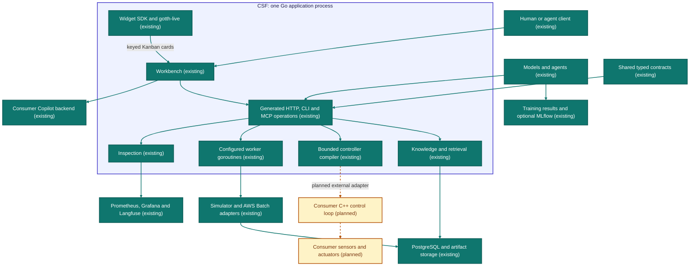

```mermaid
%% Generated from csf/compiler/language/architecture.csf; do not edit.
%% Documentation model only; status labels do not establish runtime verification.
flowchart LR
  classDef csf_existing fill:#0F766E,stroke:#115E59,stroke-width:2px,color:#FFFFFF;
  classDef csf_planned fill:#FEF3C7,stroke:#B45309,stroke-width:2px,color:#78350F;
  n_observe["Observe (existing)"]:::csf_existing
  n_retrieve["Retrieve (existing)"]:::csf_existing
  n_choose["Choose (planned)"]:::csf_planned
  n_check["Check (existing)"]:::csf_existing
  n_execute["Execute (existing)"]:::csf_existing
  n_evaluate["Evaluate (existing)"]:::csf_existing
  n_save_evidence["Save evidence (existing)"]:::csf_existing
  n_improve["Improve (planned)"]:::csf_planned
  n_select_controller["Select a controller between episodes (existing)"]:::csf_existing
  n_observe -.-> n_retrieve
  n_retrieve -.-> n_choose
  n_choose -.-> n_check
  n_check --> n_execute
  n_execute --> n_evaluate
  n_evaluate --> n_save_evidence
  n_evaluate --> n_select_controller
  n_select_controller -.->|"next agent iteration"| n_choose
  n_save_evidence -.-> n_improve
  n_improve -.->|"next iteration"| n_observe
  linkStyle 0 stroke:#B45309,stroke-width:2px,stroke-dasharray:5 5
  linkStyle 1 stroke:#B45309,stroke-width:2px,stroke-dasharray:5 5
  linkStyle 2 stroke:#B45309,stroke-width:2px,stroke-dasharray:5 5
  linkStyle 3 stroke:#0F766E,stroke-width:2px
  linkStyle 4 stroke:#0F766E,stroke-width:2px
  linkStyle 5 stroke:#0F766E,stroke-width:2px
  linkStyle 6 stroke:#0F766E,stroke-width:2px
  linkStyle 7 stroke:#B45309,stroke-width:2px,stroke-dasharray:5 5
  linkStyle 8 stroke:#B45309,stroke-width:2px,stroke-dasharray:5 5
  linkStyle 9 stroke:#B45309,stroke-width:2px,stroke-dasharray:5 5
```

<div align="center">
  
  <p><b>One Go runtime. Agent work, typed tools, shared knowledge, observable experiments.</b></p>
  <p>
    <a href="../LICENSE"></a>
    <a href="#10-contracts-and-release-evidence"></a>
    <a href="#7-try-the-library"></a>
    <a href="https://arxiv.org/abs/2603.07442"></a>
    <a href="#1-introduction"></a>
  </p>
  <p><i>Developer preview. The first release makes no stability or compatibility promise.</i></p>
  <p>
    <a href="#7-try-the-library"><b>Try the library</b></a> ·
    <a href="#8-run-the-workbench"><b>Workbench</b></a> ·
    <a href="#agent-native-onboarding"><b>Agent-native onboarding</b></a> ·
    <a href="#4-proofs-not-just-hardware"><b>Proofs</b></a> ·
    <a href="EXTENDING.md"><b>Add your code</b></a> ·
    <a href="AGENTS.md"><b>Agent instructions</b></a> ·
    <a href="#9-examples-and-boundaries"><b>Examples</b></a> ·
    <a href="docs/generated/ontology_cgen.md"><b>Terms</b></a> ·
    <a href="#11-citation"><b>Citation</b></a>
  </p>
</div>

<hr>

## 1. Introduction

CSF — The Cerebrospinal Fluid — is the library and runtime at the centre of
this repository: one Go process that composes agent sessions, typed tools,
knowledge and experiment evidence around a brain and a spine. The
[repository front page](../README.md) is the overview; this page is the
library's own technical guide.

**CSF's first release, 0.1.0, is a developer preview.** It makes no stability
or compatibility promise beyond what this page states.
This is a breaking integration baseline. Pin a reviewed snapshot and use the
examples shipped with it. The public Go import is
`github.com/candacelabs/csf/csf`; this release does not introduce a `/v2`
module or claim backward compatibility for earlier experimental CSF interfaces.

| Work | Knowledge | Evidence |
|---|---|---|
| Sessions, worktrees, schedules, and a shared Workbench | Typed tools, ingestion, and configured search | Traces, experiment results, and retained receipts |

The brain proposes. The spine executes admitted behavior. CSF supplies the
contracts and coordination that let each experiment inform the next decision.

## 2. Why Go: no IPC inside LITHE's CPU 0 (Housekeeping)


*[Figure 2](https://arxiv.org/html/2603.07442v1#S1.F2) from Lim and Clites (2026) [[1](#ref-lithe)],
arXiv:2603.07442. © the authors. Architecture inspiration: CSF coordinates the
work, knowledge, and evidence around the brain and spine.*

LITHE ([Lim and Clites, 2026](#ref-lithe)) names CPU 0 (Housekeeping) (LITHE
[§III-B](https://arxiv.org/html/2603.07442v1#S3.SS2)) and treats inter-process
communication (IPC) as an architectural concern (LITHE
[§III-C](https://arxiv.org/html/2603.07442v1#S3.SS3)). CSF applies that framing to the coordination work
inside the housekeeping layer: tools, sessions, schedules, knowledge and observation.

**CSF prevents the avoidable IPC problem within this layer by composing those
capabilities in one Go process.** Services are Go libraries selected with functional
options. They exchange typed values through function calls and coordinate
concurrent work with goroutines and channels. An internal handoff needs no
socket, wire serialization or separate service daemon. Go's
[concurrency primitives](https://go.dev/doc/effective_go#concurrency) let waiting
on tools, storage and model calls coexist in the same runtime; contexts and
explicit ownership give each operation a cancellation and cleanup path.
The [consumer example](../examples/csf-consumer/main.go) shows that composition.

PostgreSQL, OpenSearch, Langfuse and external model or simulator processes keep
their protocol boundaries. LITHE's Brain–Spine shared-memory IPC remains a
separate integration boundary. The CPU 0 mapping describes CSF's role; CPU
affinity and isolation require deployment configuration.

The repository front page draws this as a
[CPU 0 mapping diagram](../README.md#2-why-csf-no-ipc-inside-cpu-0), with the
same boundaries.

<a id="agent-native-onboarding"></a>

## 3. Agent-native onboarding

CSF is intended to be **agent-native**. Alongside human-readable READMEs,
it exposes an MCP server. The goal is a **self-changeable MCP surface** that
an agent can learn, configure and extend for the consumer repository.

The intended first instruction to your agent is **“Learn about CSF.”** The
`LearnAboutCSF` operation explains the pinned version's capabilities and
extension points and submits the embedded guidance plus selected consumer
files to the configured knowledge capability. Its first call needs no arguments.
Set `CSF_CONSUMER_ROOT` to authorize a checkout, then select relative source
paths in batches of up to 64. The response carries durable ingestion receipts
with revisions and content hashes; queued receipts become searchable when the
existing projection workers finish. Repeating the call is idempotent and
retrieves matching indexed sources. Without knowledge configuration, the tool
still explains CSF and reports that indexing is unavailable. See the
[configuration contract](docs/configuration.md); library hosts use
`WithOnboarding` for the same source authorization.

Copilot CLI history is an explicit opt-in source. Set
`CSF_COPILOT_HISTORY_SOURCE` to a native history directory that the host is
authorized to read; startup copies that directory into a disposable SDK home,
and the live source is never opened by onboarding. Select at most 16 session
IDs with `copilot_session_ids` in `LearnAboutCSF`. An empty first call does not
read history. When the source is configured, the same MCP server exposes
`ListCopilotHistorySessions`; list IDs there, then pass selected IDs to
onboarding. Library hosts can call the bridge's typed `ListHistorySessions`
method directly. Each retained document is a
decoded SDK snapshot containing metadata and events. Its receipt is queued
until projection workers index it, and only then can retrieval return it.
The SDK transport fixture verifies resume, typed event reads and disconnect.
Native acceptance with Copilot CLI 1.0.85 and SDK 1.0.11 also reads a persisted
synthetic conversation without changing its source or making another model
request. Real PostgreSQL/OpenSearch acceptance verifies retained history reaches
the lexical search index. User history is not part of those fixtures.
It guides the agent through this workflow:

1. Inspect the consumer repository and identify tooling CSF can take over.
2. Adopt CSF through its Bazel dependency, required environment settings and
   optional capabilities, keeping consumer integration code minimal.
3. Extend that same MCP server with the consumer's own tools: define their
   contracts, implement their behavior and expose them alongside CSF's tools.
4. Discover and call the resulting tools, run the consumer's checks and retain
   evidence that the integration works.

The aim is broad, mostly implicit dependence on CSF: it handles more underneath
the consumer, and improvements arrive through CSF upgrades with minimal changes
to consumer code. The agent can continue adapting its integration and adding
tools as the repository's needs change.

**Current status:** the MCP server,
[agent configuration tools](docs/standalone_onboarding.md#agent-configuration),
typed consumer registration (`WithMCPTool[In, Out]`) and the onboarding
operation exist. Consumer registration uses the pinned MCP SDK to derive and
validate schemas, and rejects name collisions with CSF operations. The host
still owns listener startup, authentication, repository authorization and
consumer checks.

## 4. Proofs, not just hardware

LITHE bounds a model-written controller with hardware: its user-space real-time
design "lacks the formal mathematical guarantees of a verified real-time
operating system" (LITHE [§V-A](https://arxiv.org/html/2603.07442v1#S5.SS1)), and
where control theory is unvalidated, "safety must be enforced via strict
hardware-level limits on torque and velocity"
(LITHE [§V-C](https://arxiv.org/html/2603.07442v1#S5.SS3)). CSF's direction is the
complementary guarantee: a typed, bounded controller language whose compiled
code is proved to compute what its source says, so a model chooses among
checked options instead of emitting arbitrary code.

[`examples/proof/BrainSpine.lean`](examples/proof/README.md) models the
arithmetic slice of
[`brainspine.proto`](../proto/candace/brainspine/v1/brainspine.proto) and
machine-checks four theorems about that bounded model:

| Theorem | Guarantee |
|---|---|
| `compile_correct` | For every expression, inputs and existing stack, the compiled instructions push exactly the evaluated value and preserve the stack. |
| `evaluate_bounds` | Every expression evaluates within the numeric saturation bound. |
| `compiled_actuator_correct` | Compiled code run from an empty stack, then through the actuator clamp, agrees exactly with the clamped source evaluator. |
| `compiled_actuator_bounds` | Every compiled expression produces an actuator value in `[-1000, 1000]`. |

`bash csf/examples/proof/check.sh` runs the pinned Lean release with
`--trust=0` and admits only Lean's standard `propext`, `Classical.choice` and
`Quot.sound` axioms. What is not proved: agreement between the Lean model and
the canonical wire semantics (a reviewed translation boundary), equivalence of
the native Go and Rust evaluators (conformance tests only), and `csfc` itself —
its [Lean verifier](compiler/verification/README.md) is a stub that returns
`notImplemented`. The actuator clamp proves a numeric range only; timing,
stability, collision avoidance, safe controller switching and physical safety
remain outside every theorem.

## 5. System diagrams

These diagrams are **generated**, not hand-maintained. The shared
[architecture model](docs/generated/architecture.csf) also produces the
[human dictionary](docs/generated/ontology_cgen.md); its syntax is specified in
[EBNF](docs/generated/grammar.ebnf). The OCaml documentation compiler checks identifiers,
references and the declared graph before rendering. Separate architecture checks
inspect selected Go ownership/process boundaries. These checks establish their
stated source constraints, not runtime timing or physical safety.

Solid connections are existing components or configurable integrations. Dotted
connections are planned. An integration shown here still needs its dependencies
and configuration; it is not automatically running when you import CSF.

<!-- csf:diagram architecture -->

<!-- /csf:diagram architecture -->

<!-- csf:diagram improvement -->

<!-- /csf:diagram improvement -->

<!-- csf:diagram simulation -->

<!-- /csf:diagram simulation -->

```mermaid
%% Generated from csf/compiler/language/architecture.csf; do not edit.
%% Documentation model only; status labels do not establish runtime verification.
flowchart LR
  classDef csf_existing fill:#0F766E,stroke:#115E59,stroke-width:2px,color:#FFFFFF;
  classDef csf_planned fill:#FEF3C7,stroke:#B45309,stroke-width:2px,color:#78350F;
  n_submit["SubmitSimulation (existing)"]:::csf_existing
  n_admitted["Recorded simulation job (existing)"]:::csf_existing
  n_start_job["Start configured local profile (existing)"]:::csf_existing
  n_local_job["Simulator container (existing)"]:::csf_existing
  n_poll_job["Read simulator status#44; progress and logs (existing)"]:::csf_existing
  n_observations["Saved simulation observations (existing)"]:::csf_existing
  n_inspect_job["InspectSimulation (existing)"]:::csf_existing
  n_submit --> n_admitted
  n_admitted --> n_start_job
  n_start_job --> n_local_job
  n_local_job -->|"simulation steps and outputs"| n_poll_job
  n_poll_job --> n_observations
  n_poll_job -->|"continue while running"| n_local_job
  n_inspect_job -->|"read state and artifact references"| n_observations
  linkStyle 0 stroke:#0F766E,stroke-width:2px
  linkStyle 1 stroke:#0F766E,stroke-width:2px
  linkStyle 2 stroke:#0F766E,stroke-width:2px
  linkStyle 3 stroke:#0F766E,stroke-width:2px
  linkStyle 4 stroke:#0F766E,stroke-width:2px
  linkStyle 5 stroke:#0F766E,stroke-width:2px
  linkStyle 6 stroke:#0F766E,stroke-width:2px
```

## 6. The architecture for self-improving autonomy

The direction is a system that can inspect a result, propose a change, evaluate
it against a fixed baseline, and retain the evidence for its next decision.
Improvement is something to measure, not a consequence of adding an agent loop.

LITHE [[1](#ref-lithe)] separates best-effort reasoning, real-time control, transport, and housekeeping.
Its **CPU 0: Housekeeping** box makes CSF's intended position concrete: coordinate
tools, records, worker lifetimes and experiments around the brain and spine.
That is our architectural mapping; CSF does not currently implement LITHE's
loader, CPU isolation, or real-time controller hot swap.


*[Figure 1](https://arxiv.org/html/2603.07442v1#S1.F1) from Lim and Clites (2026) [[1](#ref-lithe)],
arXiv:2603.07442. © the authors.*

Figures 2 and 1 are linked from the authors' [paper](https://arxiv.org/html/2603.07442v1),
not copied. They illustrate LITHE, not measured CSF hardware behavior. Their authors retain
ownership; CSF's source license does not relicense these externally hosted figures.

## 7. Try the library

Use Go 1.26. The smallest example needs no database, GPU, model account, or
extra service process. From the public repository root:

```sh
go run ./examples/csf-theme --listen 127.0.0.1:8089 --theme-dir ./examples/csf-theme
```

That mounts the generated HTTP API and MCP at `http://127.0.0.1:8089/mcp`.
It is an integration example, not the complete Workbench UI. Its essential
[implementation](../examples/csf-theme/main.go) is:

```go
service, err := csf.New(csf.WithWorkbenchThemeDirectory(themeDirectory))
if err != nil {
    return err
}
router := httpserver.NewEngine("consumer")
service.Register(router)
router.Any("/mcp", gin.WrapH(service.MCPHandler()))
return httpserver.Serve(ctx, httpserver.NewStreamingServer(address, router))
```

The service registers its generated HTTP routes and provides the MCP handler;
the caller owns the HTTP server, listener and cancellation.
Place your CSS in **`workbench-theme.css`** inside the configured directory;
`ReloadWorkbenchTheme` reloads that fixed file through the same generated API.
A missing file restores the built-in appearance. No arbitrary file path is
accepted from a tool caller.

For your own repository, start with the
[complete consumer example](../examples/csf-consumer/README.md) and
[extension guide](EXTENDING.md). The example adds a custom Go endpoint beside
CSF, uses its generated client, discovers MCP tools, reloads a theme, and tests
shutdown. The archive acceptance script creates a fresh Git repository, vendors
dependencies, then tests/builds with networking disabled.

```sh
bash examples/csf-consumer/test-archive.sh /path/to/candace-snapshot.tar.gz /tmp/csf-consumer-check
```

For Bazel consumers, use the public repository's
[archive instructions](../README.md#consume-it-in-60-seconds) and depend on
`@csf//csf`. Building that library does not start a host or database.

## 8. Run the Workbench

For native deployment, the [optional dependency package](../app/csf/native/README.md)
builds selected PostgreSQL, OpenSearch, and Langfuse dependencies as independent
[systemd services](../app/csf/native/systemd/). Langfuse uses ClickHouse and Redis;
AWS S3 is its default object store. A credential or bucket-access failure offers
an explicit MinIO opt-in that describes the local service, ports, and storage.

The supplied composition combines the CSF API, MCP, inspection, Workbench and
configured workers in one Go application process. **Application** means a
process-owning runnable composition; **service** means its owned lifecycle
component. Widgets exist inside gotth-live, CSF's web layer. A widget is not a
separate application.

Build the host and the Workbench browser assets from the public repository root:

```sh
go build -trimpath -o out/csf ./app/csf/cmd
npm --prefix services/copilot-adapter/ui ci
npm --prefix services/copilot-adapter/ui run build
```

The [runtime image recipe](../app/csf/Dockerfile) packages the same host and UI
with Git LFS and the pinned Copilot CLI. From the public repository root:

```sh
docker build -f app/csf/Dockerfile -t csf:local .
bash app/csf/test-image.sh csf:local
```

The image runs as the `node` user and contains `/app/candace-runtime` and
`/app/workbench-ui`. Its acceptance check exercises a local Git LFS worktree
checkout and HTTP startup without provider credentials. Mount the private
configuration, repository and writable worktree directory when configuring a
Workbench deployment; the image does not provide a database or credentials.

The full Workbench uses your PostgreSQL database and a configured Copilot backend.
Create a private JSON file with `{"url":"postgres://..."}` and configure an
existing repository and worktree directory. Keep credentials out of Git.

```sh
./out/csf serve \
  --listen 127.0.0.1:14111 --origin http://127.0.0.1:14111 \
  --workbench-database-config /absolute/private/workbench-db.json \
  --workbench-repository /absolute/consumer-repository \
  --workbench-worktrees /absolute/consumer-worktrees \
  --workbench-ui ./services/copilot-adapter/ui/dist \
  --workbench-theme-dir /absolute/theme-directory
```

Open **<http://127.0.0.1:14111/ui/>**. The MCP endpoint is
**<http://127.0.0.1:14111/mcp>**. The
[Workbench composition](../services/copilot-adapter/workbench/workbench.go)
accepts a caller-supplied database and backend, and has an explicit `Close`.
The Copilot bridge is a deliberate external backend boundary; it does not turn
the model execution loop into an embedded Go implementation.

For your own composition, follow the [runnable CSF host](../app/csf/cmd/main.go)
and [Workbench lifecycle](../services/copilot-adapter/workbench/README.md).
After constructing the Workbench with its database, bridge, repository and
worktree directory, call `Register(router)` and start the HTTP/MCP listener
before calling `Restore(ctx)`: restored sessions may connect to that MCP
endpoint. Workbench API routes return 503 until restoration succeeds. Then run
`Adapter.RunSchedules(ctx)` under the host's cancellation context. On shutdown,
call `Close(ctx)` with a bounded context before closing the bridge and database.

Discover capabilities from MCP `tools/list` rather than copying operation names
into a second schema. The optional JSON CLI uses the same generated contract:

```sh
printf '%s\n' '{}' | ./out/csf call --endpoint http://127.0.0.1:14111 GetSnapshot
```

## 9. Examples and boundaries

| Component | Example and implementation | What the consumer supplies |
|---|---|---|
| Mounting and custom Go | [Consumer](../examples/csf-consumer/README.md), [source](../examples/csf-consumer/main.go): mount CSF and add `/consumer/snapshot` | HTTP lifecycle and intended access policy |
| Theme configuration | [Theme](../examples/csf-theme/README.md), [source](../examples/csf-theme/main.go): `csf.WithWorkbenchThemeDirectory(directory)` | The fixed `workbench-theme.css` file |
| Agent assignment | [Agent example](../examples/csf-agent/README.md), [source](../examples/csf-agent/main.go): typed profile and session assignment | A compatible backend; complete context management remains future work |
| Knowledge | [Ingestion](examples/knowledge/README.md), [source](examples/knowledge/daily_papers.py): `python3 .../daily_papers.py fetch --date YYYY-MM-DD --out /new/snapshot` | Source documents; persistence and a model for semantic search |
| CPU controller search | [Driving experiment](examples/training/README.md), [source](examples/training/train.py): `uv run --locked python train.py --runtime /path/to/csf --output /new/run` | Python environment and fixed evaluation seeds; this is numerical search, not neural training |
| CARLA / Isaac Sim | [Workers](examples/simulators/README.md), [source](examples/simulators/carla_waypoint.py): `SubmitSimulation` then `InspectSimulation` | Vendor images, GPU, configured execution/artifact policy |
| AWS Batch | [Configuration](examples/simulators/AWS_BATCH.md), [job example](examples/simulators/aws-job-definition.example.json): choose `SIMULATION_EXECUTOR_AWS_BATCH` | Account, roles, queue, job definitions, budget and S3; real AWS acceptance remains pending |
| Formal arithmetic model | [Lean proof](examples/proof/README.md), [source](examples/proof/BrainSpine.lean): `bash csf/examples/proof/check.sh` | Pinned Lean download; theorem covers its bounded model, not the Go runtime or robot safety |
| Independent interpreter | [Rust conformance](examples/rust/README.md), [source](examples/rust/src/lib.rs): `cargo test --locked --manifest-path csf/examples/rust/Cargo.toml` | Rust toolchain; finite conformance tests are not language equivalence proofs |

Neural training, ROS recording, perception, cross-simulator equivalence, and
physical robot safety remain consumer work. See the simulator
[integration contract](examples/simulators/CONSUMER.md) for required interfaces
and evidence. A configured tool is not evidence that a job ran.

## 10. Contracts and release evidence

[`csfc`](compiler/README.md) is CSF's architecture compiler, with its own pinned
OCaml build and executable under `bin/`. Its [Lean verifier](compiler/verification/README.md)
currently provides a compiling stub that returns `notImplemented`; it does not
certify compiler output.

The [architecture model](compiler/language/architecture.csf) generates the diagrams and
[human dictionary](docs/generated/ontology_cgen.md), using the declared [grammar](docs/generated/grammar.ebnf).
The documentation compiler checks identifiers, references, and the graph;
separate architecture checks inspect selected Go ownership/process boundaries.
These establish source constraints, not runtime timing or physical safety.

[`brainspine.proto`](../proto/candace/brainspine/v1/brainspine.proto) and the
[annotated API](tools/codegen/api/adapter.proto) own the wire messages and operations.
Generated Go, Python, OpenAPI, HTTP, CLI and MCP projections share those sources.
Upstream generators keep their own filenames; Candace-generated output uses
`_cgen` where it does not conflict with the upstream convention.

```sh
bash proto/generate.sh check
bash csf/tools/codegen/generate.sh check
go test ./csf/... ./services/copilot-adapter/... ./examples/csf-consumer
```

The public repository snapshot carries `.candace-export.json`; its downloadable
source archive carries `.candace-source.json` with the source revision and tree.
The public publisher proposes each snapshot in a ready PR against `main`. After that PR is merged, the publisher verifies
the approved tree before tagging it and attaching its reproducible archive.
An open snapshot PR is a release candidate, not a published release tag.
Keep archive hashes, source revision, test receipts and any deployment receipt
separate. Generated-code and generated-documentation percentages are separate
measurements; neither is a proof coverage score.

## 11. Citation

<a id="ref-lithe"></a>

**[1]** He Kai Lim and Tyler R. Clites. *LITHE: Bridging Best-Effort Python and Real-Time
C++ for Hot-Swapping Robotic Control Laws on Commodity Linux.* arXiv:2603.07442
[cs.RO], 2026. Submitted to IROS 2026.
<https://doi.org/10.48550/arXiv.2603.07442>

```bibtex
@misc{lim2026lithe,
  title         = {{LITHE}: Bridging Best-Effort {Python} and Real-Time {C++} for Hot-Swapping Robotic Control Laws on Commodity {Linux}},
  author        = {Lim, He Kai and Clites, Tyler R.},
  year          = {2026},
  eprint        = {2603.07442},
  archivePrefix = {arXiv},
  primaryClass  = {cs.RO},
  doi           = {10.48550/arXiv.2603.07442},
  url           = {https://arxiv.org/abs/2603.07442},
  note          = {Submitted to IROS 2026}
}
```

CSF's architecture is inspired by LITHE [1]. To cite CSF itself, name the
exact release tag you used:

```bibtex
@software{csf2026,
  title   = {CSF — The Cerebrospinal Fluid},
  author  = {{Candace Labs}},
  version = {0.1.0},
  year    = {2026},
  url     = {https://github.com/candacelabs/csf}
}
```

The LITHE paper and its figures are distributed under arXiv's
[non-exclusive distribution license](http://arxiv.org/licenses/nonexclusive-distrib/1.0/),
not a Creative Commons license. © the authors; this repository's license does
not cover them, and no figure file is copied into it.

## License

Apache License 2.0. See [`LICENSE`](../LICENSE).
