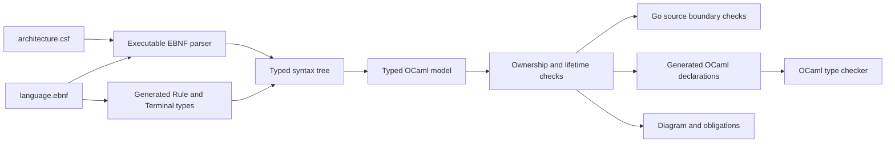

# CSF (Cerebrospinal Fluid) architecture compiler

`csfc` compiles a CSF architecture declaration into a typed OCaml model and
checks the corresponding repository sources. The first consumer is the CSF
composition continuous integration (CI) gate. The running application does not
load these architecture files. Syntax is defined in Extended Backus-Naur Form
(EBNF), a notation for grammar rules.

This directory owns CSF's architecture compiler and ships in the CSF export.
The monorepo builds these same sources and BUILD definitions directly through
its `@csf` repository; there is no second compiler tree to synchronize.

The [documentation compiler](../language/README.md) separately owns the
shared human vocabulary and documentation diagrams. This checker owns the
selected process/scope graph and Go-source inspection; its generated diagram
describes that checked declaration.

Start with the [runnable end-to-end example](WALKTHROUGH.md#run-the-complete-example).
It consumes the actual CSF composition, runs the command-line interface (CLI), uses the compiled generated
model, demonstrates rejected changes and retains a receipt. The rest of the
walkthrough explains the OCaml with examples and counterfactuals.



| Authority | Responsibility |
|---|---|
| [language.ebnf](language.ebnf) | Syntax, interpreted by the compiler; not a second documentation grammar |
| [symbol_codegen.ml](symbol_codegen.ml) → `Syntax_cgen` | The one generated vocabulary mapping grammar spellings to typed rules, terminals and enum values, including inverse mappings for emitters |
| [typed_tree.ml](typed_tree.ml), [decode.ml](decode.ml) | Resolve vocabulary once, consume every field and construct the semantic model |
| [model.ml](model.ml) | Named types for roles, ownership, lifetimes, references and crossings |
| [validate.ml](validate.ml) | Resolve references, reject incompatible relationships and derive dependency order |
| [architecture.csf](../../architecture/architecture.csf) | Selected serve-mode composition and source roots |
| [Generated review](../../architecture/generated/review_cgen.md) | Declared graph and unresolved obligations; never observed runtime state |
| [cli.ml](cli.ml) | Declarative Cmdliner options and typed subcommand dispatch |
| [compiler.ml](compiler.ml) | Reusable compilation and artifact operations; no process exit or console output |

`main.ml` only evaluates the CLI. Literal keywords and flags belong at their
textual boundaries; the compiler passes typed modes, configuration and model
values between its internal stages. The generated `syntax_cgen.ml` is a Bazel
output, not a second handwritten dictionary. Adding a terminal-only enum rule
also requires its corresponding `Model` type; OCaml compilation checks that
agreement in both directions. Missing inverse enum cases are compilation errors.
Grammar generation cannot invent the meaning of a new concept.

## Extend the language

Consumers may adapt the language in their own vendored or forked CSF checkout.
The grammar, semantic model, source policies and generators are all shipped
source, with the same build used by the monorepo. Customization is optional;
ordinary consumers can keep the upstream language and receive improvements by
updating their CSF pin.

| Change | Source to edit | Result |
|---|---|---|
| Accepted syntax and vocabulary | `language.ebnf` | Rebuilding regenerates and compiles `Syntax_cgen`; no handwritten vocabulary catalogue needs updating. |
| Meaning of a new construct | `model.ml`, `decode.ml`, `validate.ml` | Typed decoding and semantic checks implement the construct. Syntax alone does not supply its behavior. |
| Source policy | `go_policy.ml`, `generated_policy.ml`, `source_check.ml` | The rebuilt checker applies the consumer's policy. |
| Generated projections | `emit.ml`, `symbol_codegen.ml`, `codegen_header.ml` | Rebuilding and running `csfc emit` produces the consumer's outputs. |
| Human vocabulary and documentation diagrams | [Documentation compiler](../language/README.md) | Its source definition and generator produce the accompanying documentation. |

Run the build and regression commands below from that checkout, then run
`csfc check`, `csfc emit` and `csfc check-generated` against the consumer's
architecture. Select its files with `--source`, `--root` and `--output`.
`--grammar` selects syntax input for the executable; a vocabulary or semantic
change also requires rebuilding the generated types and compiler. The flag
does not load new semantic implementations into an existing binary.

Small fixed grammar fixtures test generator behavior. The actual grammar's
vocabulary is checked by compiling its generated module and round-tripping
the parsed rules and terminals through that module. These are regression
checks. Formal verification of the grammar and compiler in
[Lean](../verification/README.md) is planned; the current verifier is a stub.

## What `cgen` means

`cgen` denotes **Candace code generation**, named **CandaceCodegen** (historically
Candacegen). The `_cgen` suffix identifies a derived artifact, not a file to maintain
by hand. For example, `csf_architecture_cgen.ml` is generated OCaml source; OCaml
compiles it like any other `.ml` file.

| File | Source to edit | Regeneration |
|---|---|---|
| `syntax_cgen.ml` (Bazel output) | `language.ebnf` and, when behavior changes, `symbol_codegen.ml` | Build the compiler; Bazel runs the vocabulary generator. |
| `csf_architecture_cgen.ml`, `architecture_cgen.mmd`, `review_cgen.md` | `architecture.csf` or the owning emitter in `emit.ml` | Run `csfc emit`; use `csfc check-generated` to detect drift. |
| Example `receipt_cgen.md` | The example's execution and receipt renderer | Run the example into a fresh directory; keep earlier receipts as evidence. |

The suffix means **generated by our tooling**, not merely code written with an
AI assistant. Code outputs identify their generator in a `DO NOT EDIT` header.
Upstream generators keep their own filenames and notices: protobuf `.pb.go`,
SQLC output and other existing conventions are not renamed to `_cgen`.

The compiler's shared header is configured at build time by
[`Codegen_header.banner`](codegen_header.ml). Edit that one definition, rebuild
and regenerate. It contains a visible border, generator identity, explicit
development version, suffix explanation, a separate `DO NOT EDIT` warning and
regeneration guidance. The renderer supplies the comment syntax
for OCaml, Mermaid or Markdown. The version is the configured generator version,
not an inferred Git revision or evidence of a published release. The checker
reads its identity and warning markers from the same module; it does not keep
separate copies of the rendered banner. The configuration is checked in rather
than taken from the invoking shell, so generation remains reproducible.

This header covers this compiler's vocabulary, typed architecture, diagram,
review and example receipt. Other generators remain unchanged in this slice;
the file-policy checker continues recognizing their older Candacegen headers.
Liquid Proto retains its existing protobuf filenames and headers.

## Use

Run from the standalone `candace/` root (or `cd candace` in the monorepo). The
compiler, Tree-sitter inputs and Bazel module live together there; no monorepo
source path is required. The launcher pins Bazel and OCaml; no host OCaml
installation is needed. Serialize invocations for the same workspace; `--batch`
avoids a server surviving only inside a previous container.

```sh
bash tools/bazel.sh --batch test \
  //csf/compiler/architecture:all \
  //tools/gorilla_mux_lint:checker_test \
  //csf/architecture/generated:typed_projection \
  --lockfile_mode=error --test_output=errors --nobuild_tests_only \
  --jobs=2 --repo_env=OPAMJOBS=2
bash tools/bazel.sh --batch build \
  //csf/compiler/architecture:csfc \
  //csf/compiler/architecture:example \
  --lockfile_mode=error --jobs=2 --repo_env=OPAMJOBS=2
./bazel-bin/csf/compiler/architecture/csfc.exe check
./bazel-bin/csf/compiler/architecture/csfc.exe emit
./bazel-bin/csf/compiler/architecture/csfc.exe check-generated
```

`--source`, `--grammar`, `--root` and `--output` select inputs and projections.
Paths in declarations are normalized repository-relative paths. Missing source
roots, escaping paths and symlinks in any relative path component fail the gate.
Coverage comes from the files actually selected after traversal exclusions
(`.git`, `.cache`, `node_modules`, and nested `MODULE.bazel` boundaries),
not merely from matching path prefixes. Explicitly selected scan roots are
always visited, including independent modules. Skipped modules cannot satisfy
a declared component's source coverage. An
existing Go component must cover selected production Go source; the entrypoint
must be a selected non-test Go file declaring `package main` and `func main`.
Filesystem failures become diagnostics through the
[source-check application programming interface (API)](source_check.mli).
It reads no environment variables and performs no writes or process launches.

Comments and Go string literals are parsed by the pinned upstream Tree-sitter
Go grammar. Selected API references are matched against import alias spellings.
This does not resolve lexical shadowing or Go types: a local value shadowing an
import name can produce a conservative finding. Go compilation still owns
language validity and build-constraint selection.
The pinned Go grammar predates Go 1.26 value arguments to `new`. A bounded
compatibility pass reparses only erroneous `new` call nodes as ordinary calls,
preserving byte offsets and original text for inspection. Other parse errors
remain failures. This is source-policy parsing; Go compilation still owns Go
language validity.

## Accepted relationships

| Declaration | Compiler rule |
|---|---|
| Process | Exactly one Go application host; other endpoints are explicitly external |
| Scope | One declared parent; no cycles; resolves to its owning process |
| Service | Scoped lifetime; a name does not establish cleanup implementation |
| Manager | Conceptual coordination; may borrow a lifetime, and adds no goroutine or cleanup guarantee |
| Library, adapter, gateway | Explicit scoped or borrowed lifetime |
| Requires | Known provider in the same process and an equal or enclosing scope; no dependency cycle |
| Call | Same process; callee lifetime must contain caller lifetime |
| Channel | Same process; declaration describes a connection, not channel protocol correctness |
| Subprocess | Crosses processes through an explicitly named gateway in the caller process |
| Remote or device | Crosses processes through a named adapter or gateway |
| Existing connection | Cannot depend on a planned endpoint or boundary |

The Go source gate recognizes process entrypoints, selected listener/configuration
APIs and subprocess launch APIs. Launch references require a declared gateway
source. Test files may launch fixtures and read their environment; helper files share the entrypoint's
Go package but cannot define another `main` or own a listener. Custom-generated
files retain `_cgen`; upstream generators retain their names and disclaimers.

## Evidence boundary and next slice

The checked-in composition describes existing source, including **three separate
subprocess gateway locations**. Their consolidation is an explicit obligation,
not a completed property. `--require-closed` rejects outstanding obligations;
it is expected to fail for this composition today. Test references are checked
for existence and retained for inspection, not interpreted as passing tests.

The grammar covers one selected host composition. Package nesting, conceptual
multiplexer/queue behavior and manager coordination policy are not enforced.
A scope tree describes lifetimes, not the package hierarchy. Inbound callbacks, per-instance
terminal lifetimes, the full transitive software development kit (SDK) graph,
simulator internals and other application modes are not modeled here.
Source checks are bounded syntax-tree policy:
they do not infer arbitrary wrapper effects, dataflow, reflection, goroutine
termination or the correctness of C, foreign function interfaces (FFI) and
third-party implementations.

The next vertical slice should consume one declared service scope to generate
Go registration and cleanup around its existing implementation, then test
cancellation, joining and error propagation at that consumer boundary. This
slice changes build-time checks only. It does not add a daemon, change running
services, claim Resource Acquisition Is Initialization (RAII: scope-bound
resource cleanup) enforcement or verify the compiler in Lean.

Existing Liquid Proto, OpenAPI and SQLC schemas continue to own their contracts.
EBNF acceptance establishes syntax; the typed model and semantic passes establish
the declared relationships. Neither establishes physical safety or free proofs.
