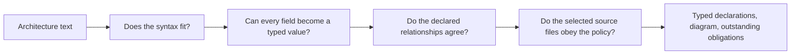

# Reading the CSF compiler as a Go programmer

CSF means **Cerebrospinal Fluid**. The compiler's EBNF (**Extended Backus-Naur
Form**) file defines the language syntax; a `.csf` file contains one architecture
written in that language. The CLI (**command-line interface**) is the executable
used below.

## Run the complete example

The [retained receipt](../../docs/lab/2026-09-17-csf-architecture-compiler/example-merged/receipt_cgen.md)
shows an executed run with its inputs, generated artifacts, diagnostics and
exit statuses. Its [source commit](../../docs/lab/2026-09-17-csf-architecture-compiler/merged-source-commit.log)
identifies the implementation used; the commands below reproduce the example.

The example uses the **entire checked-in [CSF composition](../../architecture/architecture.csf)**,
including its two services, coordinating manager, external processes and three
existing subprocess gateways. It reads the corresponding Go sources. Nothing
is started in the application; only the compiler is executed.

From the standalone `candace/` root (or `cd candace` in the monorepo):

```sh
bash tools/bazel.sh --batch build \
  //csf/compiler/architecture:csfc //csf/compiler/architecture:example \
  --lockfile_mode=error --jobs=2 --repo_env=OPAMJOBS=2
./bazel-bin/csf/compiler/architecture/example.exe \
  --root "$PWD" \
  --compiler "$PWD/bazel-bin/csf/compiler/architecture/csfc.exe" \
  --output /tmp/csf-architecture-example
```

Choose a fresh `--output` directory for each run. The runner refuses to overwrite
an earlier receipt. It retains generated artifacts, altered counterexample
inputs, subprocess stdout/stderr and `receipt_cgen.md`; its exit status is nonzero
if any observed result differs from the expected one.

| Step | What you can inspect |
|---|---|
| Check, emit, check-generated | The real CLI accepts the source and produces typed OCaml, Mermaid and a review. |
| Consume the compiled model | The example links the checked-in generated OCaml, resolves that value and compares its projections byte-for-byte with the fresh CLI output. A stale projection fails here. |
| Require all obligations closed | The real composition is rejected because cleanup and process-boundary obligations remain open. |
| Change the service to a borrowed lifetime | A modified copy of the real input is rejected by lifecycle validation. |
| Attribute terminal launching to the wrong file | A modified copy is rejected against the real Go source, even though the declaration graph alone is consistent. |
| Corrupt a generated artifact | `check-generated` rejects the changed bytes. |
| Regenerate and check again | Emission repairs the isolated outputs and both drift checking and the compiled consumer agree again. |

The [composition continuous integration (CI) job](../../.github/workflows/brain-spine-composition.yml)
runs the same executable and uploads the complete output directory, including
failure evidence. The example establishes this compiler path; it does not
establish automatic service cleanup or a verified compiler.

## What the compiler consumes

The compiler turns text into values that successive checks can understand. Each
stage answers a different question. Acceptance by an earlier stage does not
imply acceptance by a later one.

| File | Role |
|---|---|
| `language.ebnf` | Defines which sentences the language accepts, like Go's grammar. |
| `architecture.csf` | A program in that language: names the actual host, services, scopes and connections. |
| `model.ml` / `validate.ml` | Define typed meaning and consistency checks beyond sentence structure. |

The grammar cannot tell us that this application contains a service named
`workbench`, just as Go's grammar cannot tell us which functions an application
contains. The `.csf` file supplies those choices; diagrams and reviews derive
from it rather than becoming separate handwritten architecture descriptions.



## One declaration, end to end

The parser produces a **concrete syntax tree (CST)**: nodes retain grammar
structure and source tokens, including keywords and punctuation. A **leaf** is
a node with no children. For example, `service`, `workbench` and `;` become
token leaves; their enclosing declaration is a branch with children. The
decoder turns that syntax into a `Model.component` containing meaningful fields.

This is a real declaration from [architecture.csf](../../architecture/architecture.csf):

```text
service workbench in host scope application
  source "candace/services/copilot-adapter/workbench"
  state existing lifecycle scoped verification pending;
```

| Stage | What happens to this declaration | If we skipped it |
|---|---|---|
| [EBNF grammar](language.ebnf) | Requires the fields in order and a closing semicolon. `service` is one alternative of `role`. | A misspelled keyword or missing field could enter later code. |
| [Generated vocabulary](symbol_codegen.ml) | Creates `Terminal.Service` and maps it to `Model.Service`. | Separate handwritten dictionaries could disagree about the same spelling. |
| [Typed tree](typed_tree.ml) | Converts grammar rule labels and keyword text to generated variants once. Identifiers and paths remain text because they are user data. | Semantic code would keep comparing strings such as `"role"` and `"service"`. |
| [Decoder](decode.ml) | Builds a `Model.component`; rejects fields it cannot consume. | A newly added grammar field could silently disappear before validation. |
| [Validator](validate.ml) | Resolves `host` and `application`; requires a scoped service lifetime. | A service could claim to borrow a lifetime without declaring its cleanup obligations. |
| [Source check](source_check.ml) | Checks the declared path and recognized Go process-boundary APIs. | A valid declaration could refer to a missing implementation. |
| [Emitter](emit.ml) | Produces typed OCaml, a diagram and unresolved obligations from the same model. | Three independently authored descriptions could drift. |

`existing` means implementation is present. It does not mean deployed or verified.
`verification pending` preserves that distinction. Even a test-file reference
does not say that the test passed. `--require-closed` rejects those open obligations.

## The OCaml notation used here

| OCaml | Reading | Go comparison / consequence |
|---|---|---|
| `type state = Existing \| Planned` | A value has exactly one of these constructors. | Like a closed enum; it is not an arbitrary string or integer. |
| `type verification = Pending \| Test_reference of string` | One alternative carries a string. | A tagged union: the test path exists only in the `Test_reference` alternative. |
| `{ role = Service; ... }` | A record with named fields. | Similar to a struct literal. `...` here means omitted fields for explanation, not valid OCaml syntax. |
| `{ item with state = Planned }` | Construct a record with one field changed. | A copy plus a field update; this does not mutate `item`. |
| `Some path` / `None` | A value is present or absent. | An explicit optional value; no sentinel empty string is needed for absence. |
| `Ok value` / `Error diagnostics` | A computation succeeded or failed. | Similar intent to `(value, error)`, but success and failure are separate alternatives. |
| `match value with ...` | Select a branch by constructor and unpack its data. | Like switching on an enum/tag, with exhaustiveness checking. A catch-all can hide a newly added case. |
| `let f x = ...` | Define a function named `f` taking `x`. | Parameters often need no annotation because their types are inferred. |
| `let state = choice Rule.State Syntax_cgen.state` | Partially apply `choice`; the resulting function still takes a reader. | Like a closure with the first two arguments fixed. |
| `value \|> f` | Pass `value` to `f`. | `f(value)`; it neither starts a goroutine nor creates a channel. |
| `~root` | A labeled argument. | Names the argument at the call site rather than relying only on position. |
| `let* value = operation in ...` | In [compiler.ml](compiler.ml), continue only on `Ok`. | A short form of “return the error; otherwise continue.” Its meaning comes from the local `Result.bind` definition. |
| `open Model` | Allow unqualified names from module `Model`. | Name visibility, not execution or object construction. `model.ml` supplies the module. |

For example, this function distinguishes two meaningful states without a string
comparison:

```ocaml
let evidence_path = function
  | Model.Pending -> None
  | Model.Test_reference path -> Some path
```

If another verification alternative is added, an exhaustive match needs review.
If this were `string -> string option`, the OCaml type checker could not tell
whether `"pending"`, `"pendng"` or `"passed"` had been intended.

## Why strings still exist at the boundary

The text file contains spellings, so something must recognize them. The one
generated vocabulary owner is `Syntax_cgen`, built from `language.ebnf`.

```ocaml
(* Representative generated mapping; do not copy it into handwritten code. *)
let state : Terminal.t -> Model.state option = function
  | Terminal.Existing -> Some Model.Existing
  | Terminal.Planned -> Some Model.Planned
  | _ -> None
```

The generator discovers terminal-only choice rules such as `state`, `role` and
`process_kind`. It derives constructor names by convention; OCaml compilation
checks that the referenced `Model` types and constructors exist. Punctuation
spellings also have one mapping owner. Emitters use generated inverse mappings,
so they do not keep a second enum-spelling table. Those inverse matches make
missing cases a compilation error. Rules with payloads, such as
`test "path"`, still need decoder logic to assemble their meaning.

| Change | Actual consequence |
|---|---|
| Add `"paused"` to the `state` grammar without adding `Model.Paused`. | Generated OCaml refers to the missing constructor; compilation fails. |
| Add `Model.Paused` but leave the `state` grammar unchanged. | The generated inverse mapping is incomplete; compilation fails because missing enum cases are errors. |
| Introduce a new field into a grammar loaded with `--grammar`. | The decoder rejects unfamiliar or unconsumed structure; editing syntax alone does not teach it new semantics. |
| Treat every quoted string as a magic constant. | Paths, identifiers and diagnostic text become unnecessary registries. Only finite shared vocabulary needs this mapping. |
| Move every check into `main.ml`. | Every caller must become a CLI or duplicate the pipeline. Instead, [main.ml](main.ml) only evaluates Cmdliner; `Compiler.run` returns typed results. |

## Lifecycle and conceptual roles are different

| Concept | Meaning | Counterexample |
|---|---|---|
| Service | Promises cancellation, cleanup and joining of owned goroutines through its scope. | Calling a type `Service` does not install these operations. The current compiler records the obligation. |
| Child service | Still a service; its lifetime is contained within its parent's lifetime. The parent owns its shutdown, while it owns cleanup of its own work. | A nested source directory or a child scope alone does not implement parent-to-child cancellation and joining. |
| Manager | Conceptual selection or coordination. It may borrow its owner's lifetime. | Requiring every manager to create a goroutine adds behavior its name does not justify. |
| Multiplexer | Routing between producers and consumers. | A synchronous routing function need not start any goroutine. |
| In-memory task queue | Holds pending tasks in shared memory; admission and delivery need explicit policies. | A queue does not require a manager when its owning service can operate it directly. |
| Fan-out | Multiple outgoing flows, with a specified delivery policy. | Broadcasting every value and distributing each task to one worker are different behaviors. |
| `pkg/` versus nested composition | Generic libraries below more specific code owned by a service or application. | Putting code in a subdirectory does not make its goroutines children of anything. |

Only `Service` currently requires `Scoped` by role. `Manager` may be `Borrowed`.
The architecture sample therefore names the root coordinator `manager composition`;
it does not mislabel application-specific wiring as a generic library.
Asynchronous work used by a manager, multiplexer or queue still needs an owning
service. The current language does not yet express or verify that full ownership
graph, queue policies or routing semantics.

Scopes can already nest, so services can be declared in enclosing and child
scopes without inventing another role. Explicit service-to-service ownership
and the resulting cancellation/joining behavior remain a separate implementation
obligation; the current model does not derive a parent service from a scope.

The Go scheduler, allocator and garbage collector exist independently of these
declarations. `runtime` is not a project-owned architectural category; upstream
Go application programming interface (API) names remain intact.
The language says `process host kind go`.

## Try the checks

Use the pinned build command in the [README](README.md#use), then:

```sh
./bazel-bin/csf/compiler/architecture/csfc.exe check-generated
./bazel-bin/csf/compiler/architecture/csfc.exe check --require-closed
```

The first checks the real composition and reproducible projections. The second
is expected to fail while its lifecycle and gateway obligations remain open.
It is a useful counterexample: valid syntax and a consistent declaration graph
do not establish automatic cleanup, a verified compiler or hardware safety.

| Next smallest implementation slice | Evidence required |
|---|---|
| One service owning one bounded in-memory task queue and worker; add coordination only when needed. | Full-queue admission has a defined result; cancellation releases blocked operations; shutdown follows the chosen drain policy and joins the worker; borrowed dependencies remain caller-owned. |
