# One agent recipe, one inspectable assignment

This executable example prepares a named worker and submits its task through
an existing Workbench. It uses CSF's generated contracts and the Workbench's
generated client. It starts no server, backend loop or scheduler.

```mermaid
%% Generated from csf/compiler/language/architecture.csf; do not edit.
%% Documentation model only; status labels do not establish runtime verification.
flowchart LR
  classDef csf_existing fill:#0F766E,stroke:#115E59,stroke-width:2px,color:#FFFFFF;
  classDef csf_planned fill:#FEF3C7,stroke:#B45309,stroke-width:2px,color:#78350F;
  n_recipe["Agent definition and assignment file (existing)"]:::csf_existing
  n_prepare["PrepareAgentAssignment (existing)"]:::csf_existing
  n_plan["Prepared assignment (existing)"]:::csf_existing
  n_requests["Generated Workbench requests (existing)"]:::csf_existing
  n_session["Session and worktree records (existing)"]:::csf_existing
  n_copilot["Consumer Copilot backend (existing)"]:::csf_existing
  n_receipt["Assignment receipt (existing)"]:::csf_existing
  n_recipe --> n_prepare
  n_prepare --> n_plan
  n_plan --> n_requests
  n_requests --> n_session
  n_session --> n_copilot
  n_session --> n_receipt
  linkStyle 0 stroke:#0F766E,stroke-width:2px
  linkStyle 1 stroke:#0F766E,stroke-width:2px
  linkStyle 2 stroke:#0F766E,stroke-width:2px
  linkStyle 3 stroke:#0F766E,stroke-width:2px
  linkStyle 4 stroke:#0F766E,stroke-width:2px
  linkStyle 5 stroke:#0F766E,stroke-width:2px
```

<!-- csf:diagram agent_assignment -->

<!-- /csf:diagram agent_assignment -->

## Run

From the public archive or repository root containing `go.mod`:

```sh
go run ./examples/csf-agent --recipe ./examples/csf-agent/agent.json
```

The default prints a plan and performs no network requests. Before submitting,
copy the recipe, choose a fresh nonzero UUID for `assignment_id`, and replace
the example ticket, model and repository identifiers with your actual values.
Model and repository catalogs are the existing `/v1/models` and
`/v1/repositories` operations. The example identifiers are placeholders.

```sh
go run ./examples/csf-agent --recipe ./my-assignment.json \
  --workbench http://127.0.0.1:14111 --submit > assignment-receipt.json
```

`--submit` creates a worktree and session and submits the task. The JSON receipt
contains the complete prepared recipe, its fingerprints and a clickable
`session_url`. `turn_id` proves prompt acceptance was acknowledged; inspect the
session's actual turn state and evidence before claiming task completion.
Existing Workbench metrics, transcript, permissions and usage apply.

Retain both files. Replay the **same recipe** to recover the existing session
and turn through Workbench's durable idempotency records. Changing already
submitted content under the same assignment ID produces a conflict. A new
assignment needs a new ID; a changed reusable definition needs a new revision.
The scaffold fingerprints definitions but has no registry enforcing revision
uniqueness across separate assignments.

If session creation succeeds but prompt submission fails, the example emits a
partial receipt and exits nonzero. An empty `turn_id` means acceptance was not
confirmed, including an ambiguous network failure. Retry with the original
recipe rather than generating new keys. Restoring links does not resume an
interrupted tool call or establish that it succeeded.

## Mechanical extension path

| Change | Edit | Regenerate / verify |
|---|---|---|
| Another worker | Copy the example's `agent` configuration; change ID, name and instructions. | Run this same example. No new Go implementation. |
| Another task | Change assignment ID, task and ticket; select model and repository. | Same requests and receipt. |
| Another typed field | `proto/candace/brainspine/v1/brainspine.proto` | `bash proto/generate.sh write`; invoke its generated validation at the owning boundary. |
| Another CSF operation | Add operation-specific request/response messages and an annotated RPC in `csf/tools/codegen/api/adapter.proto`. | `bash csf/tools/codegen/generate.sh write`; implement the generated `IResearch` method. HTTP, Go client, CLI and MCP registration derive together. |
| Browser access to that operation | Use the generated client types. | Run `npm run gen` from `services/copilot-adapter/ui`. |
| Consumer proof | Add a focused case using `csf/consumer_fixture_test.go`. | Exercise real HTTP/MCP, validation and failure behavior. Generate mocks from the changed interfaces. |

Run generation from the public module root. The archive includes these
generators and their inputs; the shell generators require Docker, and the CSF
API generator also requires Python 3. New behavior still requires
implementation; code generation supplies the contracts and
transport plumbing. Liquid field predicates are enforced by the Go service;
not every predicate is represented in the generated MCP JSON Schema.

## Embed without another process boundary

```go
plan, err := csf.PrepareAgentAssignment(recipe)
// Handle err; retain plan with the assignment's evidence.
requests, err := csf.NewAgentWorkbenchRequests(plan)
// Handle err. Pass requests.Session to the existing adapter's CreateSession
// and requests.Prompt to SubmitPrompt, with its returned session ID.
```

The standalone example uses `SubmitAgentAssignmentHTTP` because its Workbench
already runs elsewhere. A host embedding both capabilities can call the
adapter directly. Registering the `csf.Service` exposes `PrepareAgentAssignment`
through the existing HTTP and MCP handlers; no additional listener is required.

## Ownership in this slice

| Concern | Current owner / limit |
|---|---|
| Agent definition | Caller-retained, typed recipe. Display names are not authenticated identities. |
| Session/worktree and turn records | Existing Workbench storage and lifecycle. The recipe links these records to an assignment. |
| Execution and working context | Existing Copilot backend behavior. Instructions are guidance, not permission enforcement. |
| Tool permissions | Existing host policy and approval flow. This example does not grant authority through prompt text. |
| Context takeover | Follow-up scope: CSF-owned snapshots, compression and backend-session replacement. Preparation does not implement those controls. |
| Fingerprints | SHA-256 of deterministic protobuf serialization with the pinned schema/toolchain; content identification, not signed provenance or a proof of correctness. |

Acceptance covers the shipped recipe, generated MCP/HTTP preparation,
Workbench storage, conflicting retries and host reconstruction with generated
mocks at the Copilot and filesystem/process boundaries. It does not claim a live
model completed a review.
