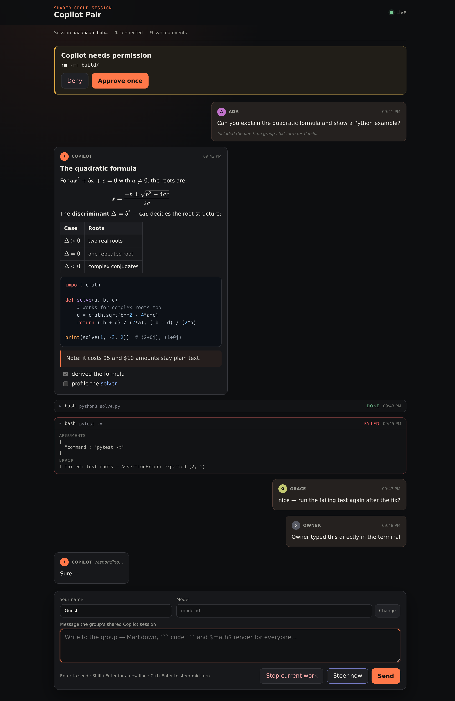
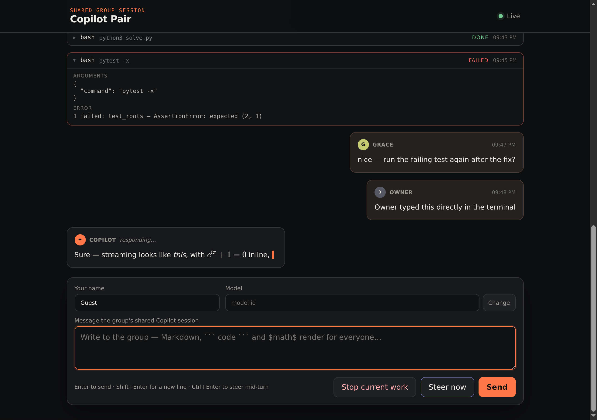
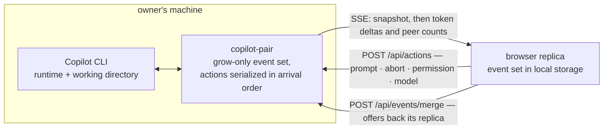

# Copilot Pair

Copilot Pair shares the foreground GitHub Copilot CLI session with everyone at
one URL, as a group chat. There are no accounts, participant roles, or separate
rooms.



The person who started Copilot owns the process; every connected browser
can:

- watch the transcript and streaming response in real time;
- send a queued prompt or steer the current turn immediately;
- stop the current turn;
- approve or deny tool requests;
- see questions and plan-review requests as they happen; and
- change the session model, picked from a dropdown of the models the session
  can actually use (with a free-text fallback when the host CLI cannot list
  models).

## Group chat, not one-on-one

Every browser prompt is relayed as `Name: message` using the name box in the
composer, and messages typed in the owner's terminal appear unprefixed as
"Owner". The very first browser prompt after the extension loads carries a
one-time preamble (visible once in the transcript and owner CLI) telling
Copilot that this is a shared group session with name-prefixed messages from
different people, so it does not treat interleaved prompts as one person's
train of thought.

## Rendering

The transcript renders Markdown (marked), TeX math in `$…$`, `$$…$$`, `\(…\)`,
or `\[…\]` form (KaTeX via marked-katex-extension), and syntax-highlighted
code blocks with a copy button (highlight.js), with all rendered HTML passed
through DOMPurify. The libraries are standard builds fetched lazily from
jsDelivr — pinned versions with subresource integrity, nothing bundled or
installed. When the CDN is unreachable the transcript falls back to plain
text and every session control keeps working. Tool calls collapse into
expandable cards that pair each start with its result (failures expand
automatically).

Composer keys: **Enter** sends, **Shift+Enter** inserts a newline, and
**Ctrl+Enter** (or Cmd+Enter) steers the current turn immediately.



(The screenshots are stored with Git LFS; in the monorepo they render only
after `git lfs pull`.)

## Run it

From this repository, start Copilot with experimental extensions enabled:

```bash
copilot --experimental
```

Then run:

```text
/pair start
```

Copilot prints a URL. Send that URL to anyone who should join the session.
`/pair status` prints it again and `/pair stop` closes it.

The extension listens on every interface and prints a link using the
machine's LAN IPv4 address (falling back to any other routable address, then
`127.0.0.1`), so anyone on the same network can open the link. Anyone who can
reach the link has full control of the session, so only run it on networks
you trust. These optional environment variables override the defaults and
must be set before starting Copilot — for example, to keep the session
local-only or to advertise a specific hostname:

```bash
COPILOT_PAIR_LISTEN=127.0.0.1 \
copilot --experimental
```

```bash
COPILOT_PAIR_PUBLIC_HOST=my-workstation.example.test \
COPILOT_PAIR_PORT=7331 \
copilot --experimental
```

`COPILOT_PAIR_PUBLIC_URL=https://pair.example.test` can override the entire
displayed origin when a reverse proxy already exists. The extension itself
does not install or reconfigure a proxy.

| Variable | Default | What it sets |
|---|---|---|
| `COPILOT_PAIR_LISTEN` | `0.0.0.0` | the bind address |
| `COPILOT_PAIR_PORT` | `0` (an ephemeral port) | the listen port; a non-integer or out-of-range value fails at start |
| `COPILOT_PAIR_PUBLIC_HOST` | when listening on `0.0.0.0`, the machine's routable IPv4 (else `127.0.0.1`); otherwise the listen address | the host in the printed link |
| `COPILOT_PAIR_PUBLIC_URL` | *(unset)* | replaces the printed origin outright |

To use the extension in every repository, copy or symlink this directory to:

```text
~/.copilot/extensions/copilot-pair/
```

## Synchronization model

Three channels, chosen per kind of traffic rather than uniformly:



Durable Copilot events form a grow-only-set CRDT keyed by the event UUID. The
SDK already supplies each event's causal `parentId`. The owner and browser
replicas merge by set union, so reconnecting browsers converge without clocks,
overwrites, or a database server. Each browser retains its replica in local
storage and offers it back to the owner when it reconnects.

Streaming token deltas and connected-peer counts are transient. They use
Server-Sent Events because they do not need conflict resolution. Browser
actions use ordinary HTTP requests; the owner process serializes them in
arrival order before calling the Copilot SDK.

The Copilot runtime and working directory remain on the owner's machine. This
extension does not merge files or replay tool calls; Git remains the history
for code changes.

## Current boundary

This is a shared Copilot session UI, not a raw terminal multiplexer. It exposes
the SDK's session controls listed above, but it does not mirror the owner's
unsent terminal input or forward arbitrary Copilot CLI slash-command
keystrokes. The actual conversation, agent work, permissions, questions, and
plans are shared. Copilot CLI 1.0.34 emits question and plan events but does not
expose an SDK response method for them, so those two dialogs must be resolved in
the owner CLI.

## Test

No install step is required: Copilot CLI supplies
`@github/copilot-sdk/extension` when it launches the extension, and the
browser rendering libraries load from the CDN at runtime.

```bash
cd extensions/copilot-pair
npm test
npm run check
```
