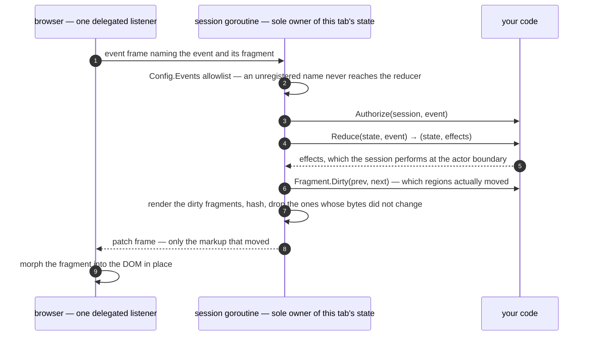

# gotth-live

Server-driven live user interfaces from Go. Your state and your rendering stay
in the Go process; the browser holds one WebSocket per tab; interactions travel
up as events, re-rendered HTML fragments travel back down, and a morph applies
them to the DOM in place. You write a pure reducer, some
[templ](https://templ.guide) fragments, and no JavaScript — the client runtime
is compiled into your binary and served by the same handler that serves the
connection, so there is no CDN and no npm. The only generator on your path is
templ, compiling your own views.

**It is v0.1.** The API makes no compatibility commitment yet. It ships inside
the `github.com/candacelabs/csf` module; pin an `export-<sha12>` snapshot as
described in the [consumer guide](../../docs/extending.md), or use a local
`replace` directive while developing against a checkout. Several `livetest`
helpers are ledgered but not implemented; their documentation identifies those
limits.

---

## The smallest application

One fragment, one event. This is the counter from
[the quickstart](docs/quickstart.md), where the two files are given whole:

<!-- sample: quickstart/main.go -->
```go
// app is the application, and it is a package-level var rather than a local in
// main so that view.templ can reach it: app.Document renders the page shell.
var app = live.MustNew(live.Config[State, live.AnonymousIdentity]{
	Reduce: func(s State, ev live.Event) (State, []live.Effect[live.AnonymousIdentity]) {
		if ev.Name == EventInc {
			s.N++
		}
		return s, nil
	},
	Fragments:    []live.Fragment[State]{{ID: "count", Render: Count}},
	Events:       []string{EventInc},
	Origins:      []string{"http://127.0.0.1:8080"},
	Authenticate: live.Anonymous,
	Authorize:    live.AllowAll[live.AnonymousIdentity],
	CSRF:         live.NoCSRFCheck,
})

func main() {
	log.Fatal(http.ListenAndServe("127.0.0.1:8080", app.Mux(MountPath, app.PageHandler(Page))))
}
```

`app.Mux` makes the three registrations a single-application server needs — the
upgrade at exactly `MountPath`, the client runtime on the subtree under it, and
the page on the catch-all — and `app.PageHandler` renders that page from
`Config.Init` on every request. Both exist because the hand-written versions
have silent failure modes: a missing subtree registration serves the runtime's
URL as HTML with no error anywhere, and `templ.Handler(Page(State{}))` freezes
the zero state into every first paint the moment `Init` starts loading
something. There is no `Config.Init` above because this application's sessions
start at the zero value, which is what a nil mount hook means.

<!-- sample: quickstart/view.templ -->
```templ
templ Count(s State) {
	<p { live.Region("count")... }>
		<output>{ strconv.Itoa(s.N) }</output>
		<button { live.On("click", EventInc)... }>+1</button>
	</p>
}

templ Page(s State) {
	@app.Document(MountPath, "gotth-live quickstart", templ.Attributes{"lang": "en"}) {
		@Count(s)
	}
}
```

`app.Document` is the page shell: the doctype, the `<html>` element with the
attributes you passed and none of its own, a `<head>` with the character
encoding, your title and the runtime's `<script>` tag, and a `<body>` around
whatever is between its braces. In dev it also emits the session inspector and
dev-reload tags — **above** the runtime, which is the ordering the inspector
needs and which no argument to this component can get wrong. `lang` is yours,
the title is required and has no default, a variadic fourth argument carries
extra head content, and `live.NoRuntime` is how a page in a live application
says it is deliberately not live.

The four security fields are required on purpose: there is no nil that means
"off", so turning a check off is something you write down, and each of the four
values above is a named symbol one `grep` finds. The quickstart explains what
replaces each of them in production.

**How big that is, by this project's own rule.** PRD FR-53 asks for a working
counter in ≤15 minutes and ≤31 lines of application code, counting every line
of Go **and** templ that is not blank, not a comment and not a `package` or
`import` line. This one is **31 — 20 Go, 11 templ**. It was 46 until the library
took four pieces of the ceremony off the application (`MustNew`, `App.Mux`,
`App.PageHandler`, and an optional `Config.Init`), and 39 until `App.Document`
took the document shell; twelve of the remaining 20 Go lines are the seven
`Config` fields `live.New` requires, and eleven are a view. **Nothing here
grades that**: the count of record is QA-1's, taken from the docs alone with a
timer, and the same gate recorded a working, clicked-in-a-real-browser counter
in 2 m 12 s: [`docs/qa/phase-4-docs-alone.md`](docs/qa/phase-4-docs-alone.md).
The line half and what remains of it:
[`docs/gates/phase-4.md`](docs/gates/phase-4.md) §4.2.

---

## One interaction, end to end

That `+1` button carries a `data-gotth-on` attribute, and one delegated
listener in the client runtime turns a click on it into an event frame. Nothing
after that point runs in the browser:



`Authenticate` runs once per connection, at the upgrade; `Authorize` runs
before the reducer for every event. `Reduce` is pure and cannot reach your
stores — it returns effects and finds out the result the same way every other
connected tab does, which is what makes two tabs unable to disagree.

---

## What it costs

The trade, from PRD §1.3: **spend server RAM, server CPU and one network round
trip per interaction; save the entire client state layer, its build toolchain,
and its class of desync bugs.** The bound on that trade is stated, not implied:

| | |
|---|---|
| Client runtime, on the wire | **10,387 bytes** minified, **4,459 bytes** `gzip -9`, against a 12,288-byte budget (NFR-2) — 63.7 % headroom. Measured by `tools/minify`; the per-subsystem breakdown and the method are in [`client/SIZE.md`](client/SIZE.md). |
| npm on the consumer path | **None.** The runtime and the protobuf codec are generated, minified and committed, so `go build` on a clean clone needs no node, no bundler and no protoc. node appears only in this repository's own client tests and benchmarks, which a consumer never runs. |
| Per interaction | One event frame up, one patch frame down, one round trip. There is no client-side reducer and no optimistic update. |
| Per tab | One WebSocket and one session goroutine, which owns that session's state and is its only writer. A session lives exactly as long as its connection: no resume, no grace window. |
| Delivery | Events are at-most-once; patches are exactly-once and in order. An effect may have executed even though the user never saw its result. |

**When not to use it** is a page, not a disclaimer:
[`docs/guide/when-not-to-use-this.md`](docs/guide/when-not-to-use-this.md) —
effects that commit outside the process and cannot be made idempotent,
interactions that need feedback faster than a round trip, and the gaps the
benchmark records as wins for the alternative.

---

## Getting started

- **Go 1.26 or newer** (`go.mod` declares `go 1.26.0`). Nothing else is needed
  to build the library.
- **templ** only to compile your own `.templ` files:
  `go install github.com/a-h/templ/cmd/templ@v0.3.1020`.
- **v0.1 is unpublished.** This library is a package of one module,
  `github.com/candacelabs/csf`, so a bootstrap consumer names that module
  once and gets the library with it:

  ```bash
  go mod edit -replace github.com/candacelabs/csf=/path/to/the/checkout/candace
  ```

  It used to take two replace directives, because the library and the Liquid
  Proto runtime it links were separate modules. They are one module now — the
  runtime is the sibling package `pkg/liquidproto` — and this replace goes away
  entirely once `candacelabs/csf` is published.

Then:

| Go to | For |
|---|---|
| [`docs/quickstart.md`](docs/quickstart.md) | A live page you built yourself, and a verification checklist that fails distinguishably at each step. |
| [`docs/README.md`](docs/README.md) | The documentation index: eleven guide pages, one per concern, phrased by what you can do at the end of each. |
| [`docs/api-surface.md`](docs/api-surface.md) | Every exported symbol, its stability, and a changelog of surface changes. |
| [`examples/gotth/`](../../examples/gotth) | Three complete applications — [counter](../../examples/gotth/counter/README.md), [chat](../../examples/gotth/chat), [dashboard](../../examples/gotth/dashboard) — packages of this same module, each `go run .` with no generator installed. |

---

## What is in this tree

| Path | What it is |
|---|---|
| [`live/`](live) | The library. Two exported packages and no more: `live`, and `live/livetest` for holding your reducer to its contract. |
| [`client/`](client) | The client runtime's source, its generated codec, the dev-only inspector and dev-reload clients, the node tests, and the size ledger. The shipped bytes are emitted into `live/clientjs/` and embedded there. |
| [`docs/`](docs) | Everything a reader needs, plus the design record that argues rather than instructs. |
| [`test/`](test), [`bench/`](bench) | The suites that keep their own trees — three routers, memory, sampling, conformance and chaos; and the benchmark harness that measures this stack against an equivalent Next.js one. The three example applications are no longer in this tree: they sit beside it, at [`examples/gotth/`](../../examples/gotth). |
| [`ci.sh`](ci.sh), [`gen.sh`](gen.sh) | The gates, and the generator whose output is committed and checked for staleness. |

Dependencies, what each buys and what writing it in-house would cost:
[`docs/dependencies.md`](docs/dependencies.md).
